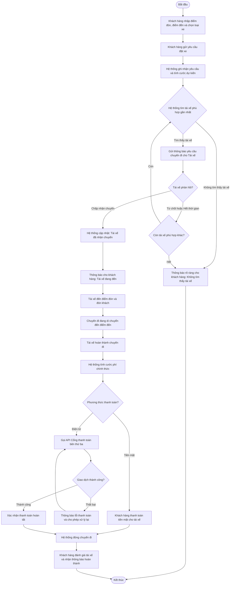
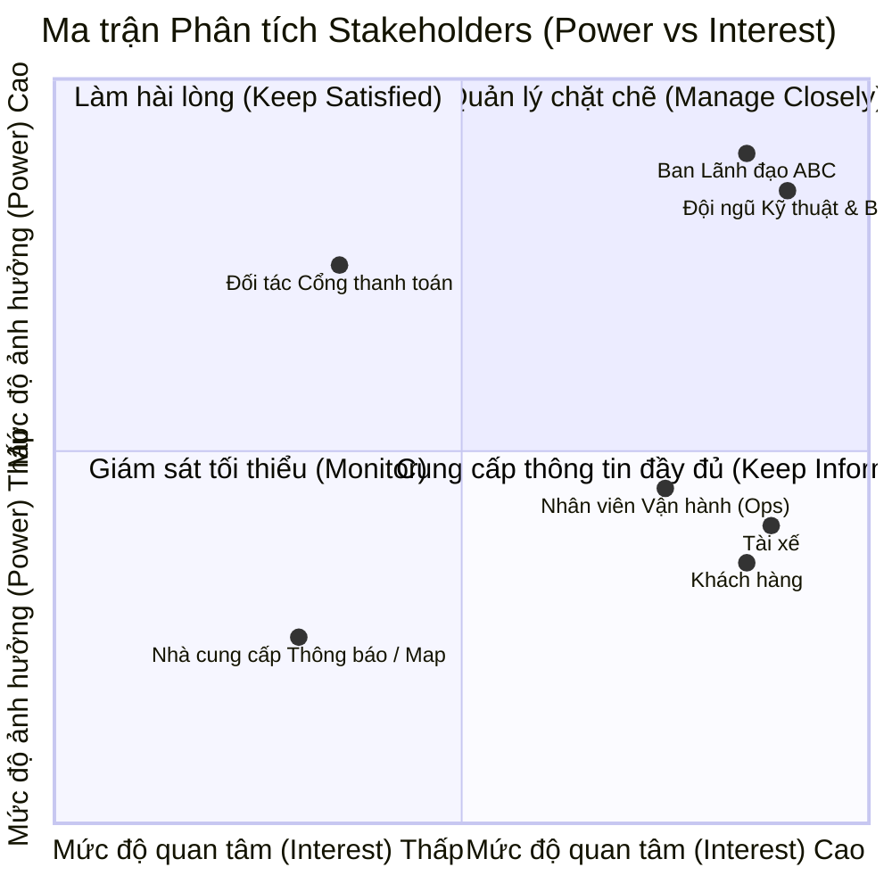
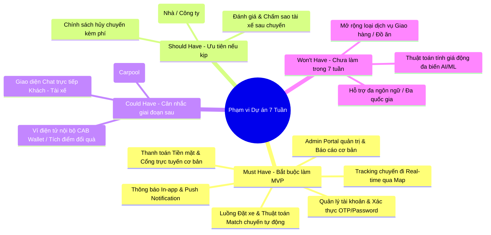
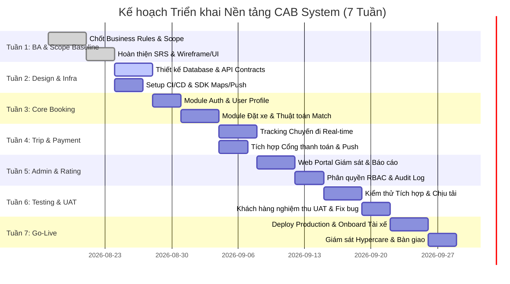
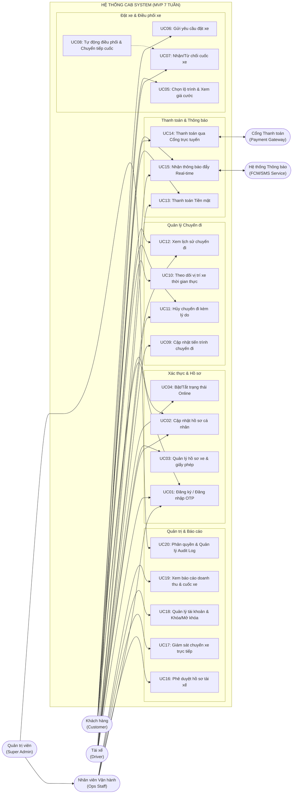

# 23637531_TranQuocThai_capsytem
# CAB System - Dự Án Nền Tảng Đặt Xe Trực Tuyến

## Bước 1: Tìm hiểu Nghiệp vụ
---
## 1. Vấn đề là gì? (Problem Statement)

Công ty ABC hiện đang vận hành dịch vụ đặt xe trực tuyến nhưng hệ thống hiện tại (tổng đài kết hợp ứng dụng đơn giản) đang bộc lộ nhiều điểm nghẽn nghiêm trọng, làm cản trở sự phát triển kinh doanh:

* **Vận hành thủ công:** Việc phân công tài xế chủ yếu dựa vào thao tác thủ công của nhân viên, gây mất thời gian và thiếu tối ưu hóa lộ trình.
* **Trải nghiệm khách hàng kém:** Khách hàng gặp khó khăn trong việc theo dõi trạng thái chuyến đi theo thời gian thực và thiếu sự minh bạch thông tin.
* **Quản lý tài chính phân mảnh:** Thông tin thanh toán chưa được quản lý tập trung, thiếu tích hợp chuẩn hóa với các cổng thanh toán điện tử hiện đại.
* **Khả năng mở rộng hạn chế:** Hệ thống cũ không đáp ứng được khi số lượng người dùng tăng đột biến, khó tích hợp thêm tính năng hoặc dịch vụ mới trong tương lai.
* **Thiếu kiểm soát bảo mật và phân quyền:** Thiếu cơ chế phân quyền rõ ràng cho nhân viên vận hành, dữ liệu cá nhân, vị trí và giao dịch chưa được bảo vệ toàn diện.

---

## 2. Mục tiêu của dự án (Project Objectives)

* **Xây dựng nền tảng CAB mới** trong thời hạn **7 tuần** với kiến trúc linh hoạt, cho phép mở rộng độc lập từng thành phần (Decoupled/Microservices-ready) nhằm dễ dàng bổ sung dịch vụ, cổng thanh toán hoặc nhà cung cấp thông báo mới mà không phải làm lại từ đầu.
* **Tự động hóa quy trình phân công chuyến đi:** Tối ưu hóa việc tìm kiếm và ghép nối tài xế dựa trên vị trí gần nhất và trạng thái sẵn sàng, kèm theo cơ chế dự phòng (fallback) tự động khi tài xế từ chối hoặc không phản hồi.
* **Nâng cao trải nghiệm toàn diện cho các bên:**
  * **Khách hàng:** Dễ dàng đặt xe, theo dõi hành trình trực tuyến, nhận thông báo đa kênh, xem lịch sử và thanh toán linh hoạt.
  * **Tài xế:** Nhận cuốc xe nhanh chóng, cập nhật trạng thái hành trình dễ dàng và minh bạch thu nhập.
  * **Nhân viên vận hành:** Cung cấp giao diện quản trị toàn diện, hệ thống báo cáo kinh doanh chi tiết (doanh thu, số lượng chuyến, tỷ lệ hoàn thành/hủy).
* **Đảm bảo tính ổn định và bảo mật cao:** Hệ thống chịu tải tốt vào giờ cao điểm, phân lập lỗi (lỗi thanh toán hay thông báo không làm sập hệ thống đặt xe), đồng thời thực hiện xác thực, phân quyền và lưu vết (audit log) đầy đủ.

---

## 3. Ai là người tham gia sử dụng hệ thống? (Actors / Users)

Hệ thống phục vụ **3 nhóm người dùng chính** cùng với **các hệ thống bên thứ ba**:

### 1. Khách hàng (Customer)
* **Vai trò:** Người có nhu cầu di chuyển, tạo yêu cầu đặt xe và sử dụng dịch vụ vận chuyển.
* **Chức năng chính:**
  * Đăng ký, đăng nhập và quản lý thông tin cá nhân.
  * Nhập điểm đón, điểm đến, lựa chọn loại xe/dịch vụ.
  * Gửi yêu cầu đặt xe và theo dõi hành trình theo thời gian thực (đang tìm tài xế, tài xế nhận chuyến, thời gian đến dự kiến).
  * Xem lịch sử chuyến đi, chi tiết cước phí.
  * Thực hiện thanh toán (tiền mặt hoặc thanh toán điện tử).
  * Nhận thông báo trạng thái chuyến đi và đánh giá tài xế sau khi hoàn thành.

### 2. Tài xế (Driver)
* **Vai trò:** Người trực tiếp cung cấp dịch vụ vận chuyển cho khách hàng.
* **Chức năng chính:**
  * Đăng ký tài khoản hoặc nhận tài khoản từ nhân viên vận hành, cập nhật hồ sơ cá nhân và thông tin phương tiện.
  * Chuyển trạng thái hoạt động (Sẵn sàng nhận chuyến / Offline).
  * Nhận thông báo khi có yêu cầu phù hợp, thực hiện chấp nhận hoặc từ chối chuyến đi.
  * Cập nhật trạng thái chuyến trong quá trình thực hiện (đã đến điểm đón, đã đón khách, đang di chuyển, hoàn thành).
  * Cung cấp dữ liệu vị trí liên tục để hệ thống hỗ trợ định vị và điều phối gần nhất.

### 3. Nhân viên vận hành / Quản trị viên (Operator / Admin)
* **Vai trò:** Quản trị hệ thống, giám sát vận hành và hỗ trợ xử lý sự cố.
* **Chức năng chính:**
  * Quản lý thông tin khách hàng, tài xế, phương tiện và chuyến đi.
  * Theo dõi các chuyến xe đang diễn ra và trạng thái hoạt động của tài xế trên giao diện quản trị.
  * Xử lý ngoại lệ (chuyến bị lỗi, hủy chuyến, tranh chấp thanh toán).
  * Tra cứu lịch sử giao dịch và xem hệ thống báo cáo (số lượng chuyến, doanh thu, tỷ lệ hoàn thành/hủy, hiệu quả tài xế).
  * Thực hiện các thao tác quản trị được kiểm soát chặt chẽ qua phân quyền (RBAC).

### 4. Hệ thống bên thứ ba (External Systems)
* **Cổng thanh toán điện tử (Payment Gateway):** Xử lý giao dịch thẻ/ví điện tử độc lập, đảm bảo không lưu trữ trực tiếp thông tin nhạy cảm tại hệ thống CAB.
* **Nhà cung cấp dịch vụ thông báo (Notification Provider):** Cung cấp hạ tầng gửi thông báo đa kênh (SMS, Push Notification, Email) đến khách hàng và tài xế.

## Bước 2: Stakeholders

> **Tài liệu Phân tích Nghiệp vụ (Business Analysis) - Bảng Stakeholders**

---

| Stakeholders | Vai trò | Tương tác với hệ thống |
| :--- | :--- | :--- |
| **Ban Giám Đốc & Chủ Đầu Tư** *(Executive Management / Business Sponsors)* | Định hướng chiến lược, phê duyệt ngân sách và quản lý tổng thể dự án trong 7 tuần. | • Theo dõi các báo cáo tổng quan (doanh thu, số lượng chuyến, tỷ lệ hoàn thành/hủy, hiệu quả tài xế). • Giám sát các chỉ số vận hành cốt lõi qua dashboard quản trị. |
| **Khách hàng** *(Customers)* | Người sử dụng dịch vụ đặt xe trực tuyến để di chuyển. | • Đăng ký, đăng nhập và quản lý tài khoản cá nhân. • Nhập điểm đón/đến, chọn loại xe và gửi yêu cầu đặt xe. • Theo dõi trạng thái chuyến đi thời gian thực (tìm tài xế, tài xế nhận chuyến, thời gian đến). • Thanh toán cước phí (tiền mặt/điện tử), xem lịch sử và đánh giá tài xế. |
| **Tài xế** *(Drivers)* | Đối tác trực tiếp cung cấp dịch vụ vận chuyển cho khách hàng. | • Đăng ký tài khoản hoặc nhận tài khoản từ vận hành, cập nhật hồ sơ và phương tiện. • Chuyển trạng thái hoạt động (Sẵn sàng / Offline) và chia sẻ dữ liệu vị trí. • Nhận thông báo cuốc xe, thực hiện chấp nhận hoặc từ chối. • Cập nhật trạng thái chuyến đi (đến điểm đón, đón khách, đang di chuyển, hoàn thành). |
| **Nhân viên vận hành / Quản trị viên** *(Operators / Admins)* | Giám sát vận hành hàng ngày, hỗ trợ xử lý sự cố và ngoại lệ của hệ thống. | • Quản lý thông tin khách hàng, tài xế, phương tiện và chuyến đi trên giao diện quản trị. • Theo dõi chuyến xe đang diễn ra và trạng thái tài xế theo thời gian thực. • Xử lý ngoại lệ (hủy chuyến, lỗi thanh toán, tranh chấp) và tra cứu lịch sử giao dịch. • Thực hiện các thao tác quản trị được kiểm soát bằng phân quyền (RBAC). |
| **Đội ngũ phát triển kỹ thuật** *(Development & Technical Team)* | Phân tích, thiết kế, lập trình, kiểm thử và triển khai hệ thống nền tảng CAB. | • Tương tác qua môi trường phát triển (Dev/Staging/Production), hệ thống quản lý mã nguồn, CI/CD. • Giám sát hiệu năng hệ thống và cấu hình các dịch vụ tích hợp. |
| **Nhà cung cấp cổng thanh toán** *(Payment Gateway Providers)* | Bên thứ ba cung cấp hạ tầng xử lý giao dịch điện tử (thẻ/ví) an toàn. | • Nhận yêu cầu thanh toán qua API từ hệ thống CAB. • Xử lý giao dịch và trả kết quả (thành công/thất bại) về hệ thống mà không lưu dữ liệu nhạy cảm tại CAB. |
| **Nhà cung cấp dịch vụ thông báo** *(Notification Providers)* | Bên thứ ba cung cấp hạ tầng gửi tin nhắn và thông báo đa kênh. | • Nhận yêu cầu từ hệ thống CAB để gửi tin nhắn (SMS, Push Notification, Email) đến khách hàng và tài xế. |

> **Sơ đồ Mermaid (Quy trình Đặt xe và Phân công Tài xế)**

---

## 🗺️ Sơ đồ Quy trình Đặt xe & Phân công (Mermaid Diagram)

> **Ma trận các bên liên quan (Stakeholder Power / Interest Matrix)

## B3: MỤC ĐÍCH NGHIỆP VỤ (BUSINESS GOALS & OBJECTIVES)

Tài liệu này xác định mục tiêu và giá trị nghiệp vụ cốt lõi mà nền tảng **CAB System** phải mang lại cho Công ty ABC nhằm giải quyết triệt để các nút thắt của hệ thống cũ và chuẩn bị cho sự phát triển dài hạn.

---

### 1. Tự động hóa và tối ưu quy trình điều phối xe (Operational Automation)
- **Xóa bỏ hoàn toàn thao tác thủ công:** Chuyển đổi mô hình phân bổ chuyến từ tổng đài viên/thủ công sang thuật toán phân phối tự động dựa trên tọa độ GPS thời gian thực, trạng thái làm việc và bán kính tối ưu.
- **Tối đa hóa tỷ lệ khớp chuyến (Match Rate):** Tự động điều hướng và chuyển tiếp yêu cầu đến các tài xế khả dụng tiếp theo nếu tài xế được đề xuất từ chối hoặc hết thời gian phản hồi (timeout), loại bỏ hoàn toàn việc khách hàng phải gửi lại yêu cầu.
- **Giảm thời gian chờ đón khách (ETA):** Ưu tiên ghép nối các tài xế gần vị trí đón nhất để tối ưu thời gian di chuyển và nâng cao năng suất hoạt động của tài xế.

---

### 2. Chuẩn hóa & nâng cao trải nghiệm người dùng (Customer & Driver Experience)
- **Minh bạch thông tin theo thời gian thực:**
  - Cung cấp giao diện trực quan cho khách hàng theo dõi từng trạng thái: *Đang tìm tài xế → Đã nhận chuyến → Đang đến điểm đón (với ETA) → Đã đón → Đang di chuyển → Hoàn thành*.
  - Lưu trữ và hiển thị rõ ràng lịch sử chuyến đi, chi tiết giá cước và biên lai điện tử.
- **Đa dạng hóa và bảo mật giao dịch:**
  - Hỗ trợ thanh toán linh hoạt bằng Tiền mặt và Ví điện tử / Thẻ thanh toán qua cổng trung gian (Payment Gateway).
  - Đảm bảo tuân thủ tiêu chuẩn an toàn bảo mật thông tin tài chính (không lưu trữ dữ liệu thẻ nhạy cảm trên máy chủ CAB).
- **Hệ thống truyền thông tin tức thời (Real-time Notification):**
  - Tự động thông báo trạng thái tức thì đến cả khách hàng và tài xế qua các kênh thông báo mở rộng (Push Notification, SMS, In-app).
- **Kiểm soát & nâng cấp chất lượng phục vụ:**
  - Cơ chế đánh giá sao (Rating) và phản hồi sau chuyến giúp sàng lọc, cải thiện chất lượng phục vụ của đội ngũ tài xế.

---

### 3. Nâng cao hiệu lực quản trị và ra quyết định (Business Intelligence & Control)
- **Quản lý dữ liệu tập trung (Centralized Operations):**
  - Giám sát toàn diện trên một bảng điều khiển duy nhất: trạng thái tài xế, chuyến xe đang hoạt động, danh mục phương tiện và hồ sơ khách hàng.
  - Hỗ trợ nhân viên vận hành can thiệp xử lý sự cố, tranh chấp hoặc chuyến lỗi nhanh chóng.
- **Phân quyền bảo mật & kiểm toán (RBAC & Audit Trail):**
  - Thiết lập ma trận phân quyền truy cập chặt chẽ (Role-Based Access Control) nhằm ngăn chặn truy cập trái phép vào các tính năng nhạy cảm.
  - Ghi nhật ký lưu vết (Audit Log) cho mọi thao tác trọng yếu để phục vụ tra cứu và kiểm toán khi phát sinh rủi ro.
- **Báo cáo kinh doanh tự động (Reporting & Metrics):**
  - Cung cấp hệ thống đo lường dữ liệu theo thời gian thực về: Doanh thu, Tổng số chuyến, Tỷ lệ hoàn thành, Tỷ lệ hủy chuyến và Hiệu suất làm việc của tài xế.

---

### 4. Đảm bảo năng lực mở rộng và độ ổn định kỹ thuật (Scalability & Resilience)
- **Duy trì tính sẵn sàng cao (High Availability):**
  - Đảm bảo hệ thống duy trì độ ổn định liên tục, đặc biệt vào các khung giờ cao điểm có lưu lượng đặt xe tăng đột biến.
- **Kiến trúc phân rã độc lập (Loose Coupling):**
  - Cô lập các thành phần phụ trợ (như Cổng thanh toán, Dịch vụ thông báo) để khi xảy ra lỗi ở các dịch vụ này không làm tê liệt luồng đặt xe cốt lõi.
  - Cho phép mở rộng (scale) độc lập từng module theo tải thực tế.
- **Khả năng thích ứng và mở rộng tương lai (Future-proof):**
  - Thiết kế kiến trúc dạng module/microservices dễ dàng tích hợp thêm loại hình dịch vụ mới, cổng thanh toán mới hoặc đối tác viễn thông mới mà không phải xây dựng lại nền tảng.

---

### 5. Mục tiêu tiến độ & chuyển giao (Project Timeline Constraint)
- **Bàn giao đúng hạn:** Hoàn thiện toàn bộ các giai đoạn từ Phân tích yêu cầu → Thiết kế → Phát triển → Kiểm thử → Triển khai thử nghiệm trong đúng khung thời gian **7 tuần**.

---

## TỔNG HỢP MA TRẬN MỤC ĐÍCH NGHIỆP VỤ & CHỈ SỐ ĐO LƯỜNG (KPIs)

| STT | Mục đích nghiệp vụ | Hiện trạng (Hệ thống cũ) | Mục tiêu hệ thống mới | Chỉ số đo lường (KPI kỳ vọng) |
| :--- | :--- | :--- | :--- | :--- |
| **01** | **Điều phối xe** | Phân công thủ công qua tổng đài, dễ quá tải. | Tự động phân chuyến theo GPS và thuật toán xoay vòng. | 100% tự động ghép chuyến; Giảm thời gian tìm tài xế xuống < 30s. |
| **02** | **Trải nghiệm khách** | Khó theo dõi trạng thái, thanh toán rời rạc. | Tracking thời gian thực, minh bạch giá, thanh toán đa kênh. | CSAT đạt > 4.5/5 sao; Tỷ lệ hủy chuyến giảm xuống < 5%. |
| **03** | **Quản trị vận hành** | Dữ liệu phân tán, thiếu báo cáo tức thì. | Dashboard tập trung, phân quyền RBAC, audit log đầy đủ. | 100% chuyến đi được lưu vết; Báo cáo doanh thu thời gian thực. |
| **04** | **Tính sẵn sàng** | Dễ sập toàn bộ nếu nghẽn hệ thống. | Tách biệt module, chịu tải độc lập theo giờ cao điểm. | Uptime đạt ≥ 99.9%; Lỗi thanh toán không làm gián đoạn đặt xe. |
| **05** | **Thời gian bàn giao** | Chưa có nền tảng hoàn chỉnh. | Triển khai phiên bản MVP sẵn sàng vận hành. | Đưa vào Golive trong vòng **7 tuần**. |

## B4: XÁC ĐỊNH PHẠM VI DỰ ÁN (PROJECT SCOPE MANAGEMENT - 7 WEEKS)

Để đảm bảo hoàn thành và bàn giao hệ thống **CAB System** trong đúng **7 tuần**, phạm vi dự án tập trung vào việc xây dựng **Sản phẩm Khả dụng Tối thiểu (MVP - Minimum Viable Product)** phục vụ đầy đủ luồng nghiệp vụ cốt lõi từ Đặt xe → Điều phối → Chuyến đi → Thanh toán → Báo cáo.

---

### 1. Phân loại Phạm vi theo Ma trận MoSCoW (Must - Should - Could - Won't)

# Business Requirements Specification: CAB System Platform
> **Dự án:** Xây dựng nền tảng đặt xe CAB System  
> **Khách hàng:** Công ty ABC  
> **Thời gian thực hiện & triển khai:** 7 tuần (MVP Scope)  
> **Vai trò phân tích:** Business Analyst (BA)  

---

---

### 2. Chi tiết Phạm vi Trong Dự án (In-Scope) & Ngoài Dự án (Out-of-Scope)

#### 🟢 A. Trong phạm vi (In-Scope) - MVP 7 Tuần

| Module / Phân hệ | Đối tượng | Mô tả chi tiết tính năng trong phạm vi (In-Scope) |
| :--- | :--- | :--- |
| **1. Xác thực & Hồ sơ** | All Roles | - Đăng ký, đăng nhập (SĐT/Mật khẩu/OTP). - Cập nhật thông tin cá nhân khách hàng & tài xế. - Đăng ký/duyệt hồ sơ phương tiện & bằng lái tài xế (Admin duyệt). |
| **2. Đặt xe & Điều phối** | Customer / Driver | - Chọn điểm đón, điểm đến qua Map API. - Chọn loại xe (Xe 4 chỗ, Xe 7 chỗ, Xe máy). - Tự động tính cước tạm tính theo quãng đường. - Thuật toán tìm & luân chuyển tài xế gần nhất theo bán kính. - Cơ chế nhận/từ chối cuốc, timeout tự động chuyển tài xế tiếp theo. |
| **3. Quản lý Chuyến đi** | Customer / Driver | - Cập nhật trạng thái chuyến theo thời gian thực (*Tìm tài xế → Đã nhận → Đã đến điểm đón → Đã đón → Hoàn thành*). - Khách hàng theo dõi vị trí xe di chuyển trên bản đồ. - Cho phép hủy chuyến (kèm lý do). |
| **4. Thanh toán & Cước** | Customer / System | - Tính toán giá cước cuối cùng dựa trên loại dịch vụ & quãng đường thực tế. - Hỗ trợ 2 phương thức: **Tiền mặt** và **Cổng thanh toán trực tuyến** (VNPAY / Momo / Thẻ qua Payment Gateway bên ngoài - không lưu thông tin thẻ nhạy cảm). - Xử lý kết quả giao dịch và cho phép thanh toán lại/chuyển tiền mặt nếu cổng lỗi. |
| **5. Hệ thống Thông báo** | Customer / Driver | - Push Notification & In-app alert cho các mốc quan trọng: Có tài xế, tài xế đến nơi, hoàn thành cuốc, kết quả thanh toán. |
| **6. Đánh giá & Phản hồi** | Customer | - Khách hàng đánh giá sao (1-5 sao) và để lại nhận xét sau khi hoàn thành chuyến đi. |
| **7. Quản trị & Báo cáo** | Ops / Admin | - Web Dashboard quản trị Khách hàng, Tài xế, Phương tiện, Chuyến đi. - Theo dõi trực quan các chuyến xe đang diễn ra trên hệ thống. - Phân quyền người dùng (RBAC cơ bản: Super Admin, Ops Staff). - Nhật ký lưu vết hệ thống (Audit Logs). - Báo cáo tổng hợp: Doanh thu, số lượng chuyến, tỷ lệ hoàn thành/hủy, hiệu suất tài xế[cite: 3]. |

---

#### 🔴 B. Ngoài phạm vi (Out-of-Scope) - Không triển khai trong 7 tuần

### 3. Kế hoạch Lộ trình Triển khai Dự án theo Tuần (7-Week Project Roadmap)

## BƯỚC 5: ĐẶC TẢ YÊU CẦU NGHIỆP VỤ (BUSINESS REQUIREMENTS - BR)

Tài liệu chuyển hóa các nhu cầu từ bài toán vận hành của Công ty ABC thành danh sách các Yêu cầu Nghiệp vụ (Business Requirements - BR) chuẩn hóa, phục vụ việc phân rã thành Functional Requirements (FR).

---

### 1. Nhóm Yêu cầu Quản lý Tài khoản & Hồ sơ (Authentication & Profile Management)

* **BR-01 (Định danh người dùng):** Hệ thống phải cung cấp cơ chế định danh duy nhất cho từng đối tượng người dùng (Khách hàng, Tài xế, Nhân viên vận hành) thông qua số điện thoại/tài khoản và mật khẩu/OTP để đảm bảo an toàn truy cập
* **BR-02 (Hồ sơ phương tiện & Tài xế):** Hệ thống phải ghi nhận và lưu trữ thông tin pháp lý của tài xế (Bằng lái xe) và thông tin phương tiện (Biển số, loại xe) để phục vụ công tác kiểm duyệt và kiểm soát chất lượng vận hành
* **BR-03 (Quản lý trạng thái trực tuyến):** Hệ thống phải cho phép tài xế chủ động chuyển đổi trạng thái làm việc (*Trực tuyến/Sẵn sàng nhận chuyến* hoặc *Ngoại tuyến*) để làm cơ sở cho thuật toán điều phối

---

### 2. Nhóm Yêu cầu Đặt xe & Ước tính Cước phí (Booking & Pricing)

* **BR-04 (Thiết lập lộ trình & Dịch vụ):** Hệ thống phải cho phép khách hàng xác định điểm đón, điểm đến trên bản đồ số và lựa chọn loại phương tiện di chuyển phù hợp (Xe máy, Xe 4 chỗ, Xe 7 chỗ)
* **BR-05 (Minh bạch cước phí):** Hệ thống phải tự động tính toán và hiển thị giá cước ước tính dựa trên loại dịch vụ và khoảng cách di chuyển thực tế trước khi khách hàng xác nhận gửi yêu cầu đặt xe

---

### 3. Nhóm Yêu cầu Điều phối & Khớp chuyến Tự động (Matching & Dispatching)

* **BR-06 (Tự động hóa điều phối):** Hệ thống phải tự động tìm kiếm và ưu tiên phân bổ chuyến đi cho tài xế đang trực tuyến gần điểm đón của khách hàng nhất trong bán kính quy định mà không cần can thiệp thủ công
* **BR-07 (Quyền quyết định nhận chuyến & Timeout):** Hệ thống phải cho phép tài xế được đề xuất quyền Chấp nhận hoặc Từ chối cuốc xe trong một khoảng thời gian giới hạn (Timeout: 15–30s)
* **BR-08 (Luân chuyển cuốc tự động):** Nếu tài xế được chỉ định từ chối hoặc không phản hồi sau thời gian quy định, hệ thống phải tự động chuyển tiếp yêu cầu đến tài xế phù hợp tiếp theo mà không bắt khách hàng phải tạo lại yêu cầu đặt xe
* **BR-09 (Xử lý khi không tìm thấy tài xế):** Hệ thống phải thông báo rõ ràng cho khách hàng trong trường hợp đã quét hết phạm vi hoặc hết thời gian tìm kiếm mà không có tài xế nào tiếp nhận chuyến đi.

---

### 4. Nhóm Yêu cầu Thực thi Chuyến đi & Định vị (Trip Execution & Tracking)

* **BR-10 (Đồng bộ vòng đời chuyến đi):** Hệ thống phải ghi nhận và đồng bộ tức thời các mốc trạng thái thực tế của chuyến đi: *Đã nhận chuyến → Đang đến điểm đón → Đã đón khách → Đang di chuyển → Hoàn thành*[cite: 4].
* **BR-11 (Giám sát vị trí thời gian thực):** Hệ thống phải liên tục cập nhật và hiển thị tọa độ GPS của phương tiện trên giao diện bản đồ của khách hàng, kèm thời gian dự kiến đến (ETA)[cite: 4].
* **BR-12 (Chính sách hủy chuyến):** Hệ thống phải cho phép các bên (Khách hàng/Tài xế) hủy chuyến trước khi chuyến đi chính thức bắt đầu và bắt buộc ghi nhận lý do hủy chuyến[cite: 4].

---

### 5. Nhóm Yêu cầu Thanh toán & Đối soát (Payment & Financial Security)

* **BR-13 (Đa dạng hóa phương thức thanh toán):** Hệ thống phải hỗ trợ khách hàng thanh toán cước chuyến đi bằng Tiền mặt hoặc Thanh toán điện tử (qua Cổng thanh toán trung gian)
* **BR-14 (Bảo mật dữ liệu tài chính):** Hệ thống tuyệt đối không lưu trữ dữ liệu nhạy cảm của thẻ thanh toán hoặc tài khoản ngân hàng trên máy chủ nội bộ CAB
* **BR-15 (Xử lý sự cố giao dịch):** Khi giao dịch thanh toán trực tuyến thất bại, hệ thống phải thông báo lỗi cho khách hàng và cho phép thực hiện thanh toán lại hoặc chuyển đổi sang hình thức tiền mặt

---

### 6. Nhóm Yêu cầu Truyền thông & Thông báo (Notification & Communication)

* **BR-16 (Thông báo tức thời):** Hệ thống phải tự động gửi thông báo (Push/In-app) đến khách hàng và tài xế tại từng sự kiện trọng yếu (Khi có tài xế nhận, khi tài xế đến điểm đón, khi hoàn tất cuốc, kết quả thanh toán)
* **BR-17 (Khả năng mở rộng kênh thông báo):** Module thông báo phải được thiết kế dạng module độc lập để có thể tích hợp thêm các kênh liên lạc mới (SMS, ZNS...) trong tương lai mà không làm ảnh hưởng đến luồng đặt xe cốt lõi[

---

### 7. Nhóm Yêu cầu Quản trị Vận hành & Báo cáo (Operations & Reporting)

* **BR-18 (Bảng điều khiển tập trung):** Hệ thống phải cung cấp giao diện quản trị tập trung cho phép nhân viên vận hành theo dõi trạng thái hoạt động của tài xế, danh sách phương tiện và các chuyến xe đang diễn ra trên hệ thống theo thời gian thực
* **BR-19 (Kiểm soát truy cập & Phân quyền - RBAC):** Hệ thống phải phân định quyền hạn rõ ràng giữa các vai trò quản trị (Super Admin, Ops Staff) để ngăn chặn truy cập trái phép vào các tính năng nhạy cảm
* **BR-20 (Nhật ký lưu vết - Audit Trail):** Hệ thống phải tự động ghi nhận nhật ký (log) cho mọi thao tác quản trị và thay đổi trạng thái quan trọng nhằm phục vụ kiểm tra, xử lý khiếu nại hoặc sự cố
* **BR-21 (Báo cáo kinh doanh tự động):** Hệ thống phải tổng hợp và trực quan hóa các chỉ số vận hành cốt lõi: Tổng doanh thu, tổng số lượng chuyến, tỷ lệ hoàn thành chuyến, tỷ lệ hủy chuyến và hiệu suất làm việc của tài xế
---

## 📋 BẢNG MA TRẬN TRUY VẾT YÊU CẦU NGHIỆP VỤ (REQUIREMENTS TRACEABILITY MATRIX)

| Mã BR | Tên yêu cầu nghiệp vụ | Đối tượng thụ hưởng | Module hệ thống liên quan | Mức độ ưu tiên (MoSCoW) |
| :--- | :--- | :--- | :--- | :---: |
| **BR-01** | Xác thực & Định danh người dùng | Customer, Driver, Ops | Auth & Profile | **Must-Have** |
| **BR-02** | Quản lý hồ sơ xe & tài xế | Driver, Ops | Auth & Profile | **Must-Have** |
| **BR-03** | Bật/tắt trạng thái nhận chuyến | Driver | Auth & Profile | **Must-Have** |
| **BR-04** | Nhập lộ trình & Chọn loại xe | Customer | Booking & Pricing | **Must-Have** |
| **BR-05** | Tính cước tạm tính theo cự ly | Customer | Booking & Pricing | **Must-Have** |
| **BR-06** | Tự động ghép tài xế gần nhất | System, Driver | Dispatching Engine | **Must-Have** |
| **BR-07** | Quyền nhận/từ chối cuốc (Timeout) | Driver | Dispatching Engine | **Must-Have** |
| **BR-08** | Tự động chuyển tiếp khi từ chối | System, Customer | Dispatching Engine | **Must-Have** |
| **BR-09** | Thông báo khi không tìm thấy xe | Customer | Dispatching Engine | **Must-Have** |
| **BR-10** | Đồng bộ vòng đời chuyến đi | Customer, Driver | Trip Lifecycle | **Must-Have** |
| **BR-11** | Theo dõi GPS xe thời gian thực | Customer | Trip Lifecycle | **Must-Have**|
| **BR-12** | Hủy chuyến kèm lý do | Customer, Driver | Trip Lifecycle | **Must-Have** |
| **BR-13** | Thanh toán Tiền mặt & Cổng online | Customer, Driver | Payment Module | **Must-Have**[cite: 3] |
| **BR-14** | Bảo mật thông tin thanh toán | Customer, System | Payment Module | **Must-Have**|
| **BR-15** | Xử lý lỗi giao dịch trực tuyến | Customer, Ops | Payment Module | **Must-Have** |
| **BR-16** | Gửi thông báo đẩy tức thời | Customer, Driver | Notification Module | **Must-Have** |
| **BR-17** | Mở rộng kênh thông báo độc lập | System | Notification Module | **Must-Have** |
| **BR-18** | Dashboard giám sát vận hành | Ops, Admin | Admin Portal | **Must-Have** |
| **BR-19** | Phân quyền truy cập quản trị (RBAC) | Admin, Ops | Admin Portal| **Must-Have** |
| **BR-20** | Nhật ký lưu vết hệ thống (Audit Log)| Ops, Admin | Admin Portal | **Must-Have**|
| **BR-21** | Báo cáo doanh thu & hiệu suất | Management, Ops | Admin Portal | **Must-Have** |

## BƯỚC 5: ĐẶC TẢ YÊU CẦU NGHIỆP VỤ (BUSINESS REQUIREMENTS - BR)

### 1. Nhóm Yêu cầu Quản lý Tài khoản & Hồ sơ (Authentication & Profile Management)

* **BR-01 (Định danh người dùng):** Hệ thống phải cung cấp cơ chế định danh duy nhất cho từng đối tượng người dùng (Khách hàng, Tài xế, Nhân viên vận hành) thông qua số điện thoại/tài khoản và mật khẩu/OTP để đảm bảo an toàn truy cập.
* **BR-02 (Hồ sơ phương tiện & Tài xế):** Hệ thống phải ghi nhận và lưu trữ thông tin pháp lý của tài xế (Bằng lái xe) và thông tin phương tiện (Biển số, loại xe) để phục vụ công tác kiểm duyệt và kiểm soát chất lượng vận hành.
* **BR-03 (Quản lý trạng thái trực tuyến):** Hệ thống phải cho phép tài xế chủ động chuyển đổi trạng thái làm việc (*Trực tuyến/Sẵn sàng nhận chuyến* hoặc *Ngoại tuyến*) để làm cơ sở cho thuật toán điều phối.

---

### 2. Nhóm Yêu cầu Đặt xe & Ước tính Cước phí (Booking & Pricing)

* **BR-04 (Thiết lập lộ trình & Dịch vụ):** Hệ thống phải cho phép khách hàng xác định điểm đón, điểm đến trên bản đồ số và lựa chọn loại phương tiện di chuyển phù hợp (Xe máy, Xe 4 chỗ, Xe 7 chỗ).
* **BR-05 (Minh bạch cước phí):** Hệ thống phải tự động tính toán và hiển thị giá cước ước tính dựa trên loại dịch vụ và khoảng cách di chuyển thực tế trước khi khách hàng xác nhận gửi yêu cầu đặt xe.

---

### 3. Nhóm Yêu cầu Điều phối & Khớp chuyến Tự động (Matching & Dispatching)

* **BR-06 (Tự động hóa điều phối):** Hệ thống phải tự động tìm kiếm và ưu tiên phân bổ chuyến đi cho tài xế đang trực tuyến gần điểm đón của khách hàng nhất trong bán kính quy định mà không cần can thiệp thủ công.
* **BR-07 (Quyền quyết định nhận chuyến & Timeout):** Hệ thống phải cho phép tài xế được đề xuất quyền Chấp nhận hoặc Từ chối cuốc xe trong một khoảng thời gian giới hạn (Timeout: 15–30s).
* **BR-08 (Luân chuyển cuốc tự động):** Nếu tài xế được chỉ định từ chối hoặc không phản hồi sau thời gian quy định, hệ thống phải tự động chuyển tiếp yêu cầu đến tài xế phù hợp tiếp theo mà không bắt khách hàng phải tạo lại yêu cầu đặt xe.
* **BR-09 (Xử lý khi không tìm thấy tài xế):** Hệ thống phải thông báo rõ ràng cho khách hàng trong trường hợp đã quét hết phạm vi hoặc hết thời gian tìm kiếm mà không có tài xế nào tiếp nhận chuyến đi.

---

### 4. Nhóm Yêu cầu Thực thi Chuyến đi & Định vị (Trip Execution & Tracking)

* **BR-10 (Đồng bộ vòng đời chuyến đi):** Hệ thống phải ghi nhận và đồng bộ tức thời các mốc trạng thái thực tế của chuyến đi: *Đã nhận chuyến → Đang đến điểm đón → Đã đón khách → Đang di chuyển → Hoàn thành*.
* **BR-11 (Giám sát vị trí thời gian thực):** Hệ thống phải liên tục cập nhật và hiển thị tọa độ GPS của phương tiện trên giao diện bản đồ của khách hàng, kèm thời gian dự kiến đến (ETA).
* **BR-12 (Chính sách hủy chuyến):** Hệ thống phải cho phép các bên (Khách hàng/Tài xế) hủy chuyến trước khi chuyến đi chính thức bắt đầu và bắt buộc ghi nhận lý do hủy chuyến.

---

### 5. Nhóm Yêu cầu Thanh toán & Đối soát (Payment & Financial Security)

* **BR-13 (Đa dạng hóa phương thức thanh toán):** Hệ thống phải hỗ trợ khách hàng thanh toán cước chuyến đi bằng Tiền mặt hoặc Thanh toán điện tử (qua Cổng thanh toán trung gian).
* **BR-14 (Bảo mật dữ liệu tài chính):** Hệ thống tuyệt đối không lưu trữ dữ liệu nhạy cảm của thẻ thanh toán hoặc tài khoản ngân hàng trên máy chủ nội bộ CAB.
* **BR-15 (Xử lý sự cố giao dịch):** Khi giao dịch thanh toán trực tuyến thất bại, hệ thống phải thông báo lỗi cho khách hàng và cho phép thực hiện thanh toán lại hoặc chuyển đổi sang hình thức tiền mặt.

---

### 6. Nhóm Yêu cầu Truyền thông & Thông báo (Notification & Communication)

* **BR-16 (Thông báo tức thời):** Hệ thống phải tự động gửi thông báo (Push/In-app) đến khách hàng và tài xế tại từng sự kiện trọng yếu (Khi có tài xế nhận, khi tài xế đến điểm đón, khi hoàn tất cuốc, kết quả thanh toán).
* **BR-17 (Khả năng mở rộng kênh thông báo):** Module thông báo phải được thiết kế dạng module độc lập để có thể tích hợp thêm các kênh liên lạc mới (SMS, ZNS...) trong tương lai mà không làm ảnh hưởng đến luồng đặt xe cốt lõi.

---

### 7. Nhóm Yêu cầu Quản trị Vận hành & Báo cáo (Operations & Reporting)

* **BR-18 (Bảng điều khiển tập trung):** Hệ thống phải cung cấp giao diện quản trị tập trung cho phép nhân viên vận hành theo dõi trạng thái hoạt động của tài xế, danh sách phương tiện và các chuyến xe đang diễn ra trên hệ thống theo thời gian thực.
* **BR-19 (Kiểm soát truy cập & Phân quyền - RBAC):** Hệ thống phải phân định quyền hạn rõ ràng giữa các vai trò quản trị (Super Admin, Ops Staff) để ngăn chặn truy cập trái phép vào các tính năng nhạy cảm.
* **BR-20 (Nhật ký lưu vết - Audit Trail):** Hệ thống phải tự động ghi nhận nhật ký (log) cho mọi thao tác quản trị và thay đổi trạng thái quan trọng nhằm phục vụ kiểm tra, xử lý khiếu nại hoặc sự cố.
* **BR-21 (Báo cáo kinh doanh tự động):** Hệ thống phải tổng hợp và trực quan hóa các chỉ số vận hành cốt lõi: Tổng doanh thu, tổng số lượng chuyến, tỷ lệ hoàn thành chuyến, tỷ lệ hủy chuyến và hiệu suất làm việc của tài xế.

---

## 📋 BẢNG MA TRẬN TRUY VẾT YÊU CẦU NGHIỆP VỤ (REQUIREMENTS TRACEABILITY MATRIX)

| Mã BR | Tên yêu cầu nghiệp vụ | Đối tượng thụ hưởng | Module hệ thống liên quan | Mức độ ưu tiên (MoSCoW) |
| :--- | :--- | :--- | :--- | :---: |
| **BR-01** | Xác thực & Định danh người dùng | Customer, Driver, Ops | Auth & Profile | **Must-Have** |
| **BR-02** | Quản lý hồ sơ xe & tài xế | Driver, Ops | Auth & Profile | **Must-Have** |
| **BR-03** | Bật/tắt trạng thái nhận chuyến | Driver | Auth & Profile | **Must-Have** |
| **BR-04** | Nhập lộ trình & Chọn loại xe | Customer | Booking & Pricing | **Must-Have** |
| **BR-05** | Tính cước tạm tính theo cự ly | Customer | Booking & Pricing | **Must-Have** |
| **BR-06** | Tự động ghép tài xế gần nhất | System, Driver | Dispatching Engine | **Must-Have** |
| **BR-07** | Quyền nhận/từ chối cuốc (Timeout) | Driver | Dispatching Engine | **Must-Have** |
| **BR-08** | Tự động chuyển tiếp khi từ chối | System, Customer | Dispatching Engine | **Must-Have** |
| **BR-09** | Thông báo khi không tìm thấy xe | Customer | Dispatching Engine | **Must-Have** |
| **BR-10** | Đồng bộ vòng đời chuyến đi | Customer, Driver | Trip Lifecycle | **Must-Have** |
| **BR-11** | Theo dõi GPS xe thời gian thực | Customer | Trip Lifecycle | **Must-Have** |
| **BR-12** | Hủy chuyến kèm lý do | Customer, Driver | Trip Lifecycle | **Must-Have** |
| **BR-13** | Thanh toán Tiền mặt & Cổng online | Customer, Driver | Payment Module | **Must-Have** |
| **BR-14** | Bảo mật thông tin thanh toán | Customer, System | Payment Module | **Must-Have** |
| **BR-15** | Xử lý lỗi giao dịch trực tuyến | Customer, Ops | Payment Module | **Must-Have** |
| **BR-16** | Gửi thông báo đẩy tức thời | Customer, Driver | Notification Module | **Must-Have** |
| **BR-17** | Mở rộng kênh thông báo độc lập | System | Notification Module | **Must-Have** |
| **BR-18** | Dashboard giám sát vận hành | Ops, Admin | Admin Portal | **Must-Have** |
| **BR-19** | Phân quyền truy cập quản trị (RBAC) | Admin, Ops | Admin Portal | **Must-Have** |
| **BR-20** | Nhật ký lưu vết hệ thống (Audit Log)| Ops, Admin | Admin Portal | **Must-Have** |
| **BR-21** | Báo cáo doanh thu & hiệu suất | Management, Ops | Admin Portal | **Must-Have** |

## BƯỚC 6: PHÂN RÃ YÊU CẦU CHỨC NĂNG (FUNCTIONAL REQUIREMENTS - FR)

Tài liệu phân rã chi tiết các Yêu cầu Nghiệp vụ (Business Requirements) thành các Yêu cầu Chức năng cụ thể (Functional Requirements - FR) theo từng phân hệ cho dự án 7 tuần.

---

### 1. Phân hệ 1: Xác thực & Quản lý Tài khoản (Authentication & Profile)

* **FR-AUTH-01 (Đăng ký tài khoản):** Hệ thống cho phép Khách hàng và Tài xế đăng ký tài khoản bằng Số điện thoại, họ tên và mật khẩu; gửi mã OTP qua SMS/Push để xác thực số điện thoại[cite: 4].
* **FR-AUTH-02 (Đăng nhập / Đăng xuất):** Hệ thống hỗ trợ đăng nhập qua Số điện thoại + Mật khẩu hoặc OTP; hỗ trợ chức năng "Quên mật khẩu" và cho phép người dùng đăng xuất an toàn[cite: 4].
* **FR-AUTH-03 (Quản lý hồ sơ cá nhân):** Người dùng (Khách hàng / Tài xế) có thể xem và cập nhật thông tin cá nhân (Ảnh đại diện, họ tên, email)[cite: 4].
* **FR-AUTH-04 (Hồ sơ phương tiện & Giấy tờ tài xế):** Tài xế có thể tải lên/cập nhật thông tin phương tiện (Biển số xe, hãng xe, loại xe: 2 bánh, 4 chỗ, 7 chỗ) và ảnh chụp Giấy phép lái xe[cite: 4].
* **FR-AUTH-05 (Chuyển đổi trạng thái hoạt động):** Tài xế có nút gạt để chủ động chuyển đổi giữa 2 trạng thái: `Online (Sẵn sàng nhận cuốc)` và `Offline (Nghỉ ngơi)`[cite: 4].

---

### 2. Phân hệ 2: Đặt xe & Ước tính Cước phí (Booking & Fare Estimation)

* **FR-BOOK-01 (Chọn điểm đón & Điểm đến):** Hệ thống tích hợp Map API cho phép khách hàng ghim vị trí đón/trả trên bản đồ hoặc tìm kiếm địa chỉ thông qua ô nhập liệu có gợi ý tự động (Autocomplete)[cite: 4].
* **FR-BOOK-02 (Lựa chọn loại dịch vụ):** Hệ thống hiển thị danh sách các loại xe khả dụng (Xe máy, Xe 4 chỗ, Xe 7 chỗ) kèm thời gian dự kiến tài xế đến đón (ETA)[cite: 4].
* **FR-BOOK-03 (Ước tính cước phí tạm tính):** Hệ thống tự động tính toán và hiển thị trước giá cước ước tính dựa trên công thức cố định theo quãng đường và loại xe trước khi đặt chuyến[cite: 4].
* **FR-BOOK-04 (Gửi yêu cầu đặt xe):** Khách hàng chọn phương thức thanh toán (Tiền mặt / Thẻ / Ví) và nhấn nút "Đặt xe" để khởi tạo đơn chuyến[cite: 4].
* **FR-BOOK-05 (Hủy yêu cầu đặt xe):** Khách hàng có thể hủy yêu cầu đặt xe khi hệ thống đang trong giai đoạn tìm kiếm tài xế mà không bị tính phí[cite: 4].

---

### 3. Phân hệ 3: Điều phối & Ghép Chuyến Tự động (Matching & Dispatching)

* **FR-DISP-01 (Tìm kiếm tài xế gần nhất):** Khi nhận yêu cầu đặt xe, hệ thống tự động quét tọa độ GPS để lọc ra danh sách các tài xế đang `Online` trong bán kính quy định (mặc định: 3km–5km) phù hợp với loại xe được yêu cầu[cite: 4].
* **FR-DISP-02 (Gửi yêu cầu đến tài xế):** Hệ thống gửi thông tin chuyến đi (Điểm đón, điểm đến, khoảng cách, giá cước tạm tính) đến tài xế ưu tiên nhất kèm bộ đếm ngược thời gian phản hồi (15s–30s)[cite: 4].
* **FR-DISP-03 (Phản hồi chuyến đi):** Tài xế có thể chọn `Chấp nhận` hoặc `Từ chối` chuyến xe trong thời gian đếm ngược[cite: 4].
* **FR-DISP-04 (Tự động luân chuyển chuyến - Fallback):** Nếu tài xế từ chối hoặc hết thời gian đếm ngược (Timeout) mà không phản hồi, hệ thống tự động loại tài xế đó và chuyển tiếp cuốc xe đến tài xế phù hợp tiếp theo[cite: 4].
* **FR-DISP-05 (Thông báo hết lượt tìm kiếm):** Nếu sau số lần chuyển tiếp tối đa (hoặc hết thời gian quét) mà không có tài xế nhận, hệ thống tự động hủy đơn và gửi thông báo "Không tìm thấy tài xế khả dụng" đến khách hàng.

---

### 4. Phân hệ 4: Quản lý Chuyến đi & Định vị Real-time (Trip Execution & Tracking)

* **FR-TRIP-01 (Cập nhật tiến trình chuyến đi):** Hệ thống cung cấp các nút bấm cho tài xế cập nhật trạng thái chuyến theo thứ tự: `Đã đến điểm đón` → `Đã đón khách` → `Hoàn thành chuyến đi`[cite: 4].
* **FR-TRIP-02 (Theo dõi xe trên bản đồ thời gian thực):** Hệ thống nhận tọa độ GPS từ thiết bị tài xế (mỗi 3-5s) và render trực tiếp vị trí xe di chuyển trên bản đồ của khách hàng[cite: 4].
* **FR-TRIP-03 (Hủy chuyến sau khi ghép xe thành công):** Khách hàng hoặc tài xế có thể hủy chuyến trước khi tài xế bấm `Đã đón khách` kèm theo việc bắt buộc chọn lý do hủy[cite: 4].
* **FR-TRIP-04 (Tra cứu lịch sử chuyến đi):** Khách hàng và tài xế có thể xem danh sách các chuyến đi đã hoàn thành hoặc đã hủy kèm chi tiết lộ trình, thời gian, số tiền và thông tin đối tác[cite: 4].

---

### 5. Phân hệ 5: Thanh toán & Tính cước (Payment & Billing)

* **FR-PAY-01 (Tính cước thực tế khi hoàn thành):** Khi tài xế bấm `Hoàn thành chuyến đi`, hệ thống tính toán giá cước cuối cùng dựa trên quãng đường/thời gian thực tế và hiển thị hóa đơn điện tử cho cả 2 bên[cite: 4].
* **FR-PAY-02 (Thanh toán Tiền mặt):** Nếu khách chọn tiền mặt, màn hình tài xế hiển thị số tiền cần thu; tài xế bấm nút "Đã nhận đủ tiền" để kết thúc cuốc xe[cite: 4].
* **FR-PAY-03 (Thanh toán Trực tuyến qua Cổng Payment):** Hệ thống gọi API Cổng thanh toán bên ngoài để xử lý giao dịch và nhận kết quả qua Webhook; tuyệt đối không lưu trữ số thẻ/CVV của khách hàng[cite: 4].
* **FR-PAY-04 (Xử lý lỗi thanh toán trực tuyến):** Nếu cổng thanh toán báo lỗi hoặc quá hạn, hệ thống thông báo lỗi cho khách hàng và cho phép thử lại hoặc chuyển sang thanh toán bằng tiền mặt[cite: 4].

---

### 6. Phân hệ 6: Hệ thống Thông báo (Notification)

* **FR-NOTI-01 (Thông báo trạng thái cuốc xe):** Tự động gửi Push Notification / In-app alert cho khách hàng và tài xế khi ghép chuyến thành công, khi tài xế đến điểm đón, khi hoàn thành chuyến và kết quả thanh toán[cite: 4].
* **FR-NOTI-02 (Thông báo cho tài xế):** Phát âm thanh chuông cảnh báo và rung màn hình khi có cuốc xe mới được điều phối tới.

---

### 7. Phân hệ 7: Quản trị Vận hành & Báo cáo (Admin Portal)

* **FR-ADM-01 (Quản lý tài khoản người dùng):** Nhân viên vận hành có thể tìm kiếm, xem chi tiết, khóa hoặc mở khóa tài khoản Khách hàng và Tài xế[cite: 4].
* **FR-ADM-02 (Phê duyệt hồ sơ tài xế & phương tiện):** Nhân viên vận hành kiểm tra ảnh bằng lái, thông tin xe và bấm "Duyệt" hoặc "Từ chối" hồ sơ đăng ký tài xế[cite: 4].
* **FR-ADM-03 (Bảng giám sát chuyến đi Real-time):** Dashboard hiển thị trực quan danh sách các chuyến xe đang diễn ra, trạng thái tài xế và cảnh báo chuyến xe bị lỗi/treo[cite: 4].
* **FR-ADM-04 (Phân quyền người dùng - RBAC):** Hệ thống phân chia quyền rõ ràng giữa `Super Admin` và `Ops Staff` để kiểm soát thao tác nhạy cảm[cite: 4].
* **FR-ADM-05 (Ghi nhật ký hệ thống - Audit Trail):** Tự động lưu vết lịch sử mọi thao tác thay đổi trạng thái, can thiệp cuốc xe hoặc duyệt tài khoản của nhân viên vận hành[cite: 4].
* **FR-ADM-06 (Báo cáo thống kê kinh doanh):** Bảng tổng hợp số liệu cho phép lọc theo ngày/tuần/tháng về tổng số chuyến đi, doanh thu, tỷ lệ hoàn thành/hủy và hiệu suất tài xế[cite: 4].

# Business Requirements Specification: CAB System Platform
> **Dự án:** Xây dựng nền tảng đặt xe CAB System[cite: 4]  
> **Khách hàng:** Công ty ABC[cite: 4]  
> **Thời gian thực hiện & triển khai:** 7 tuần (MVP Core Scope)[cite: 4]  
> **Vai trò phân tích:** Business Analyst (BA)[cite: 4]  

---

## 📌 BƯỚC 7: SƠ ĐỒ USE CASE TỔNG QUAN (USE CASE DIAGRAM)

Sơ đồ mô hình hóa toàn bộ sự tương tác giữa các tác nhân (Actors) và các ca sử dụng cốt lõi (Use Cases) trong phạm vi hệ thống **CAB System (MVP 7 tuần)**[cite: 4].

---

### 1. Sơ đồ Use Case Tổng Thể Hệ Thống (System Use Case Diagram)

