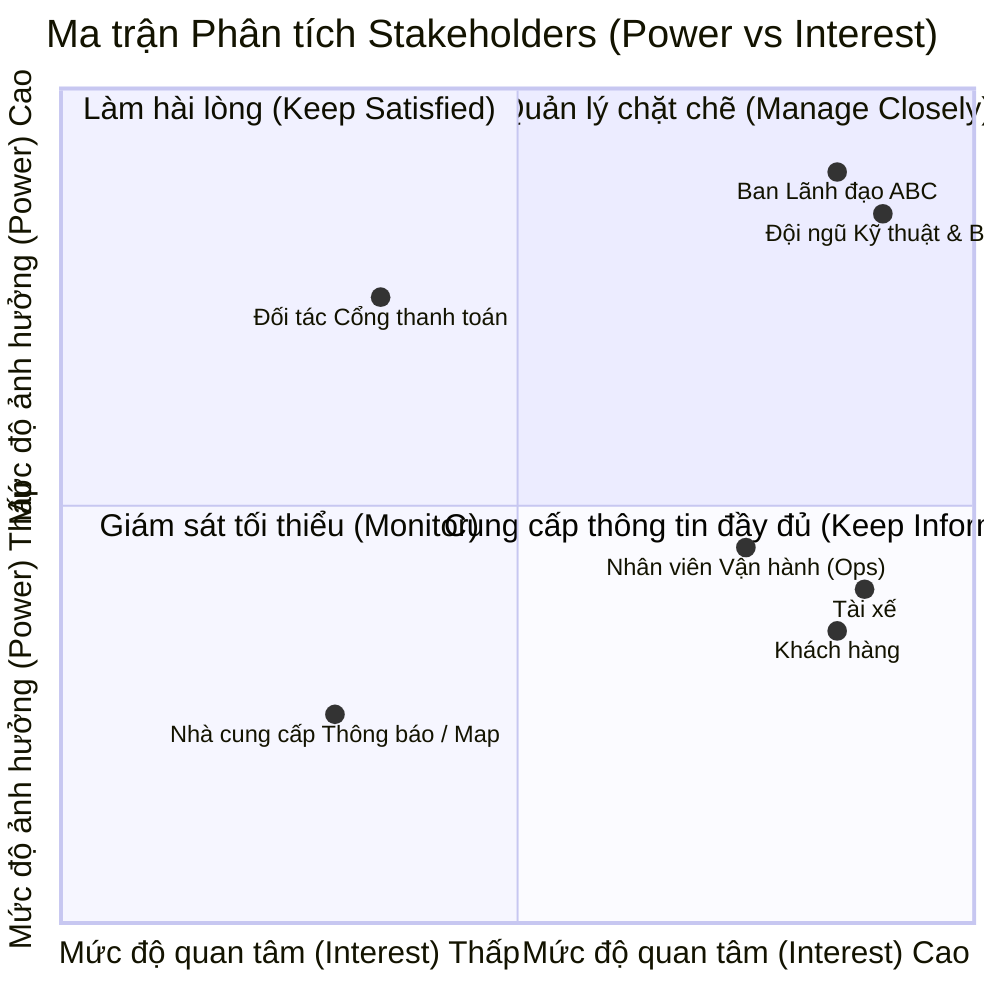
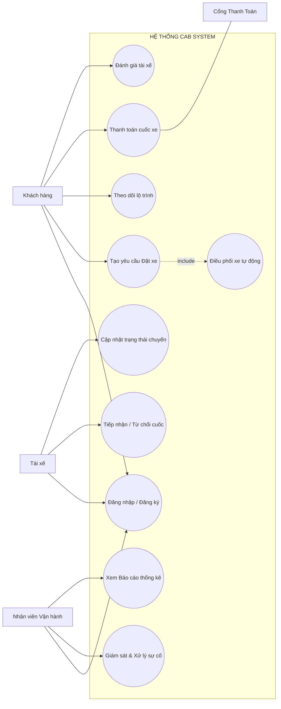
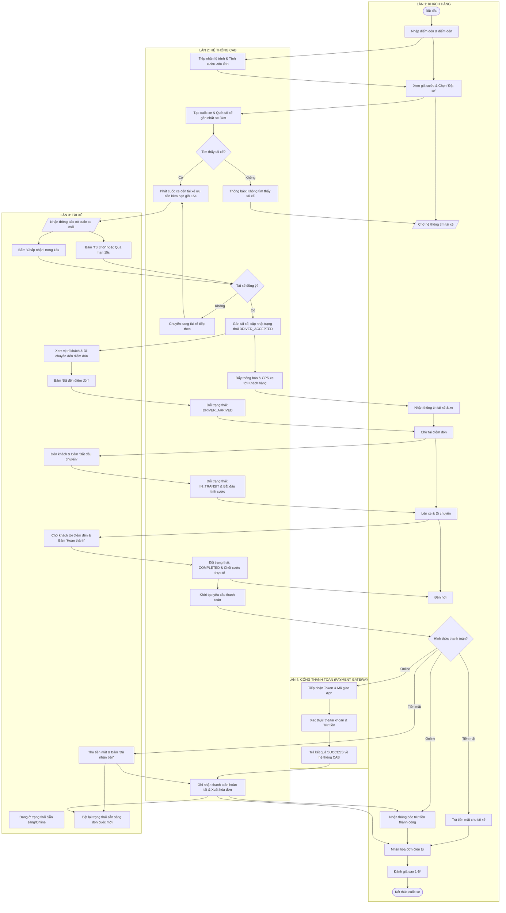
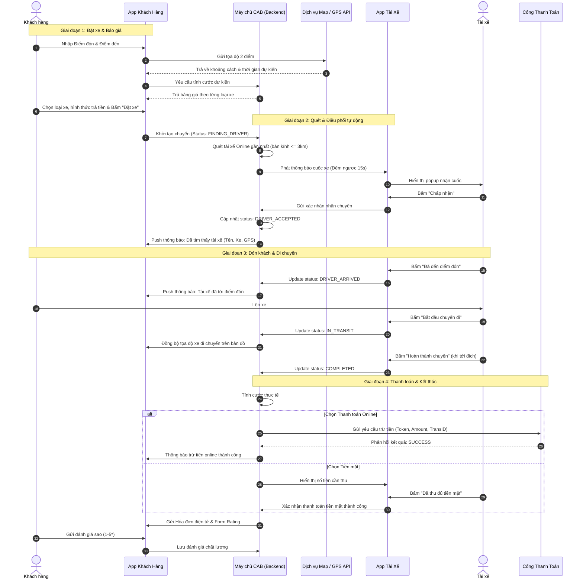

# 23637531_TranQuocThai_capsytem
# BÁO CÁO PHÂN TÍCH YÊU CẦU HỆ THỐNG ĐẶT XE TRỰC TUYẾN (CAB SYSTEM)

> **Môn học:** Phát triển ứng dụng  
> **Dự án:** Nền tảng đặt xe trực tuyến CAB System (Công ty ABC)  
> **Thời gian thực hiện:** 07 tuần  

---

## 📌 BƯỚC 1: TÌM HIỂU NGHIỆP VỤ

### 1.1. Vấn đề hiện tại (Problem Statement)
* **Phân công thủ công:** Điều phối tài xế qua tổng đài hoặc app cũ chủ yếu làm bằng tay, dẫn đến thời gian chờ cuốc lâu và dễ sai sót.
* **Thiếu minh bạch lộ trình:** Khách hàng không theo dõi được vị trí tài xế theo thời gian thực (Real-time tracking) và trạng thái đón/trả.
* **Quản lý thanh toán phân tán:** Dữ liệu thanh toán chưa tập trung, thiếu tích hợp cổng thanh toán trực tuyến bảo mật.
* **Hạn chế mở rộng:** Hạ tầng cũ khó chịu tải vào giờ cao điểm, khó tích hợp thêm tính năng mới mà không làm gián đoạn hệ thống.

### 1.2. Mục tiêu hệ thống mới (Objectives)
* **Tự động hóa 100%** quy trình tìm và gán chuyến dựa trên vị trí GPS và trạng thái sẵn sàng của tài xế.
* **Minh bạch hóa hành trình:** Cập nhật vị trí, lộ trình và thời gian dự kiến đón xe theo thời gian thực.
* **Tích hợp thanh toán an toàn:** Kết nối cổng thanh toán trực tuyến (tuân thủ bảo mật, không lưu thông tin thẻ nhạy cảm trên máy chủ CAB).
* **Kiến trúc Module linh hoạt:** Tách biệt các module (Thanh toán, Thông báo, Đặt xe) để lỗi một thành phần không làm sập toàn bộ hệ thống.

### 1.3. Các đối tượng tham gia sử dụng hệ thống
* **Khách hàng (Customer):** Đăng ký/đăng nhập, tìm chuyến, đặt xe, theo dõi tài xế, thanh toán và đánh giá dịch vụ.
* **Tài xế (Driver):** Bật/tắt trạng thái sẵn sàng, tiếp nhận/từ chối cuốc, cập nhật trạng thái di chuyển (đến điểm đón, đang chở, hoàn tất).
* **Nhân viên vận hành (Operator/Admin):** Giám sát các cuốc xe, hỗ trợ xử lý sự cố/khiếu nại, duyệt tài khoản tài xế và xem báo cáo thống kê.
* **Hệ thống bên thứ ba (External Services):** Dịch vụ Bản đồ (Map/GPS API), Cổng thanh toán trực tuyến, Dịch vụ gửi tin nhắn/thông báo (Push Notification).

---

## 👥 BƯỚC 2: PHÂN TÍCH CÁC BÊN LIÊN QUAN (STAKEHOLDERS)

### 2.1. Danh sách Stakeholder và Vai trò
| Stakeholder | Vai trò trong hệ thống | Mức độ tương tác |
| :--- | :--- | :--- |
| **Ban Giám đốc (Sponsor)** | Định hướng chiến lược, cấp vốn, theo dõi doanh thu và KPI. | Gián tiếp qua Dashboard báo cáo |
| **Khách hàng (Customer)** | Đặt chuyến, thanh toán, phản hồi chất lượng dịch vụ. | Trực tiếp trên App Khách hàng |
| **Tài xế (Driver)** | Tiếp nhận chuyến, đón trả khách, nhận thù lao. | Trực tiếp trên App Tài xế |
| **Nhân viên Vận hành (Operator)** | Quản lý người dùng, hỗ trợ cuốc xe sự cố, kiểm soát vận hành. | Trực tiếp trên Web Quản trị (Admin Portal) |
| **Đội ngũ BA / Dev / QA** | Phân tích, xây dựng, kiểm thử và bàn giao sản phẩm trong 7 tuần. | Trực tiếp trong toàn bộ chu kỳ phát triển |
| **Đối tác Thanh toán / Maps** | Cung cấp hạ tầng thanh toán online và dịch vụ bản đồ số. | Tương tác qua API / Webhook |

### 2.2. Ma trận Phân loại Stakeholder (Mendelow Matrix)
* **Manage Closely (Quản lý chặt chẽ - Quyền lực cao, Quan tâm cao):** Ban Giám đốc ABC, Trưởng phòng Vận hành.
* **Keep Satisfied (Làm họ hài lòng - Quyền lực cao, Quan tâm thấp):** Cổng thanh toán đối tác, Cơ quan quản lý pháp lý vận tải.
* **Keep Informed (Cập nhật thường xuyên - Quyền lực thấp, Quan tâm cao):** Khách hàng, Đội ngũ Tài xế, Nhân viên CSKH.
* **Monitor (Giám sát tối thiểu - Quyền lực thấp, Quan tâm thấp):** Nhà cung cấp hạ tầng hosting/máy chủ.
> **Ma trận các bên liên quan (Stakeholder Power / Interest Matrix)


---

## 🎯 BƯỚC 3: MỤC ĐÍCH NGHIỆP VỤ (BUSINESS GOALS)

* **BG-01:** Rút ngắn thời gian khớp chuyến (Matching) từ 3–5 phút xuống dưới **30 giây**.
* **BG-02:** Nâng tỷ lệ hoàn thành cuốc xe đạt trên **90%**, giảm tỷ lệ hủy chuyến do chờ lâu xuống dưới **8%**.
* **BG-03:** Giảm **70%** sự can thiệp thủ công từ bộ phận tổng đài và vận hành.
* **BG-04:** Đảm bảo độ sẵn sàng hệ thống đạt **99.5%**, chịu tải tốt trong các khung giờ cao điểm.

---

## ⏱️ BƯỚC 4: XÁC ĐỊNH PHẠM VI DỰ ÁN 7 TUẦN (SCOPE MANAGEMENT)

### 4.1. Trong phạm vi (In-Scope - Hoàn thành trong 7 tuần)
* **Quản lý Tài khoản & Định danh:** Đăng ký, đăng nhập (OTP/Mật khẩu), phân quyền 3 nhóm người dùng (Khách, Tài xế, Quản trị).
* **Điều phối & Đặt xe tự động:** Chọn lộ trình, tính cước ước tính, quét và tự động chuyển cuốc cho tài xế gần nhất (bán kính $\le 3\text{km}$).
* **Theo dõi chuyến xe (Trip Lifecycle):** Quản lý trạng thái thực tế (*Đang tìm $\rightarrow$ Đã nhận $\rightarrow$ Đã đến $\rightarrow$ Đang chở $\rightarrow$ Hoàn tất / Hủy*).
* **Thanh toán cơ bản:** Thanh toán tiền mặt và tích hợp 01 Cổng thanh toán trực tuyến (Sandbox).
* **Thông báo (In-app Push Notification):** Gửi thông báo thay đổi trạng thái cuốc xe cho khách và tài xế.
* **Quản trị cơ bản (Admin Portal):** Theo dõi chuyến xe trực tiếp, khóa/mở tài khoản, xuất báo cáo doanh thu & tỷ lệ cuốc xe.

### 4.2. Ngoài phạm vi (Out-of-Scope - Phát triển ở các giai đoạn sau)
* Tính năng đi chung xe / ghép chuyến (Carpooling).
* Tích hợp ví điện tử nội bộ hoặc hệ thống tích điểm đổi thưởng (Loyalty Program).
* Thuật toán AI nâng cao dự báo nhu cầu đặt xe theo thời tiết.

---

## 📋 BƯỚC 5: CHUYỂN ĐỔI YÊU CẦU NGHIỆP VỤ (BUSINESS REQUIREMENTS - BR)

* **BR-01 (Quản lý hồ sơ):** Hệ thống phải quản lý định danh người dùng và xác thực thông tin phương tiện của tài xế.
* **BR-02 (Cơ chế Matching tự động):** Tự động phát cuốc cho tài xế tối ưu nhất; nếu tài xế từ chối hoặc quá thời gian phản hồi (15s), hệ thống tự chuyển tài xế kế tiếp mà không yêu cầu khách thao tác lại.
* **BR-03 (Minh bạch giá cước):** Giá cước dự kiến phải được hiển thị rõ ràng trước khi khách bấm xác nhận đặt xe.
* **BR-04 (Bảo mật tài chính):** Tuyệt đối không lưu trữ thông tin thẻ ngân hàng/CVV trên máy chủ CAB, toàn bộ ủy quyền qua cổng thanh toán đạt chuẩn bảo mật.
* **BR-05 (Cách ly sự cố):** Lỗi của dịch vụ thông báo hoặc cổng thanh toán không được làm tê liệt chức năng đặt và hoàn thành cuốc xe (cho phép fallback sang tiền mặt).

---

## ⚙️ BƯỚC 6: PHÂN RÃ YÊU CẦU CHỨC NĂNG (FUNCTIONAL REQUIREMENTS)
```text
CAB System
├── 1. Quản lý Tài khoản & Hồ sơ
│   ├── 1.1 Đăng ký / Đăng nhập (OTP / Mật khẩu)
│   ├── 1.2 Cập nhật hồ sơ cá nhân & thông tin xe
│   └── 1.3 Bật / Tắt trạng thái sẵn sàng (Online / Offline)
├── 2. Quản lý Đặt xe & Điều phối
│   ├── 2.1 Chọn điểm đón/đến & Ước tính cước phí
│   ├── 2.2 Gửi yêu cầu đặt xe
│   ├── 2.3 Thuật toán Matching (Tìm & Chuyển tài xế tự động)
│   └── 2.4 Hủy chuyến (Khách hàng / Tài xế)
├── 3. Quản lý Chuyến đi & Đánh giá
│   ├── 3.1 Theo dõi vị trí tài xế theo thời gian thực (GPS)
│   ├── 3.2 Cập nhật trạng thái (Đã đến, Đã đón khách, Hoàn tất)
│   └── 3.3 Đánh giá chất lượng cuốc xe (1 - 5 sao)
├── 4. Thanh toán & Hóa đơn
│   ├── 4.1 Tính cước phí thực tế sau chuyến
│   ├── 4.2 Xử lý thanh toán Tiền mặt / Cổng thanh toán trực tuyến
│   └── 4.3 Xem lịch sử chuyến đi & Biên lai điện tử
├── 5. Hệ thống Thông báo (Notification)
│   ├── 5.1 Push Notification trạng thái chuyến đi
│   └── 5.2 Thông báo kết quả giao dịch thanh toán
└── 6. Quản trị & Vận hành (Admin)
├── 6.1 Giám sát chuyến xe thời gian thực
├── 6.2 Phân quyền & Quản lý tài khoản (Khóa/Mở tài xế, khách hàng)
└── 6.3 Báo cáo thống kê: Doanh thu, Tỷ lệ hoàn thành, Tỷ lệ hủy
```
---

## 🗺️ BƯỚC 7: SƠ ĐỒ USE CASE (USE CASE DIAGRAM)

### 7.1. Bảng Use Case theo Actor
* **Khách hàng:** Đăng nhập/Đăng ký, Tạo yêu cầu đặt xe, Hủy chuyến, Theo dõi lộ trình, Thanh toán cuốc xe, Đánh giá tài xế, Xem lịch sử chuyến.
* **Tài xế:** Đăng nhập, Bật/Tắt sẵn sàng nhận chuyến, Tiếp nhận/Từ chối cuốc, Cập nhật tiến trình chuyến, Xem thu nhập.
* **Nhân viên Quản trị:** Giám sát chuyến đi, Can thiệp cuốc xe sự cố, Quản lý tài khoản, Xem báo cáo thống kê.
* **Cổng thanh toán:** Xác thực giao dịch và phản hồi kết quả thanh toán.

### 7.2. Biểu đồ Use Case (Mermaid Diagram)

---
# BƯỚC 8: ĐẶC TẢ CÁC USE CASE CỐT LÕI (USE CASE SPECIFICATION)

---

## 1. ĐẶC TẢ USE CASE 01: ĐẶT CHUYẾN XE (BOOK A RIDE)

### 1.1. Thông tin chung
* **Mã Use Case:** `UC-BOOK-01`
* **Tên Use Case:** Đặt chuyến xe trực tuyến
* **Tác nhân chính (Primary Actor):** Khách hàng (Customer)
* **Tác nhân hỗ trợ (Supporting Actors):** Tài xế (Driver), Dịch vụ Bản đồ (Map API), Cổng thanh toán (Payment Gateway)
* **Mục tiêu:** Cho phép khách hàng tìm tuyến đường, biết trước cước phí và kết nối với tài xế gần nhất để thực hiện chuyến đi.
* **Tiền điều kiện (Pre-conditions):**
  1. Khách hàng đã đăng nhập thành công vào ứng dụng CAB.
  2. Thiết bị của khách hàng đã bật định vị (GPS) và có kết nối mạng Internet.
* **Hậu điều kiện (Post-conditions):**
  1. Chuyến xe được khởi tạo ở trạng thái `DRIVER_ACCEPTED`.
  2. Thông tin tài xế và vị trí xe hiển thị trên màn hình khách hàng.

---

### 1.2. Luồng sự kiện chính (Basic Flow)

| Bước | Hành động của Tác nhân (Actor Action) | Phản hồi của Hệ thống (System Response) |
| :---: | :--- | :--- |
| **1** | Khách hàng mở màn hình đặt xe, nhập **Điểm đón** và **Điểm đến**. | Hệ thống gợi ý địa chỉ qua Maps API và xác định tọa độ hai điểm. |
| **2** | Khách hàng xác nhận lộ trình. | Hệ thống tính toán quãng đường, thời gian dự kiến và hiển thị bảng giá cước ước tính cho từng loại dịch vụ (Xe 4 chỗ, 7 chỗ, Xe máy...). |
| **3** | Khách hàng chọn loại dịch vụ, phương thức thanh toán (Tiền mặt / Thẻ online) và nhấn **"Đặt xe ngay"**. | Hệ thống xác thực yêu cầu, tạo bản ghi chuyến xe mới ở trạng thái `FINDING_DRIVER`. |
| **4** | | Hệ thống quét tọa độ GPS và xác định danh sách các tài xế đang ở trạng thái `ONLINE/READY` trong bán kính phù hợp (bán kính $\le 3\text{km}$). |
| **5** | | Hệ thống gửi thông báo yêu cầu chuyến đi kèm bộ đếm ngược **15 giây** tới tài xế ưu tiên số 1 (gần nhất/phù hợp nhất). |
| **6** | Tài xế nhận thông báo và bấm **"Chấp nhận"** trong vòng 15 giây. | Hệ thống khóa cuốc xe cho tài xế này, đổi trạng thái chuyến sang `DRIVER_ACCEPTED`. |
| **7** | | Hệ thống gửi thông báo đẩy (Push Notification) cho khách hàng, hiển thị thông tin tài xế (Tên, SĐT, Biển số xe, Rating) và định vị thời gian thực của xe đang di chuyển tới điểm đón. |
| **8** | Use Case kết thúc thành công. | |

---

### 1.3. Các luồng thay thế & Ngoại lệ (Alternative & Exception Flows)

* **4a. Không tìm thấy tài xế nào khả dụng trong khu vực:**
  * Hệ thống hiển thị thông báo lỗi: *"Hiện không tìm thấy tài xế gần vị trí của bạn. Vui lòng thử lại sau ít phút hoặc chọn loại phương tiện khác."*
  * Cập nhật trạng thái chuyến thành `NO_DRIVER_FOUND`.
  * Kết thúc Use Case.

* **6a. Tài xế ưu tiên bấm "Từ chối" hoặc quá 15 giây không phản hồi:**
  * Hệ thống tự động chuyển tiếp thông báo mời nhận chuyến tới tài xế tối ưu tiếp theo trong danh sách chờ.
  * Quy trình tìm kiếm lặp lại tối đa 3 lần.
  * Nếu sau 3 lần không có tài xế nào nhận chuyến, chuyển sang luồng `4a`.
  * Khách hàng **không phải nhập lại dữ liệu hay bấm đặt lại từ đầu**.

* **3a. Khách hàng chủ động nhấn "Hủy tìm kiếm" khi đang quét tài xế:**
  * Hệ thống dừng thuật toán quét tài xế.
  * Hủy thông báo chuyến đi (nếu đang phát tới tài xế).
  * Chuyển trạng thái cuốc sang `CANCELLED_BY_CUSTOMER` và không áp dụng bất kỳ khoản phí nào.

---

## 2. ĐẶC TẢ USE CASE 02: CẬP NHẬT TRẠNG THÁI CHUYẾN ĐI (UPDATE TRIP STATUS)

### 2.1. Thông tin chung
* **Mã Use Case:** `UC-TRIP-02`
* **Tên Use Case:** Cập nhật trạng thái chuyến đi
* **Tác nhân chính:** Tài xế (Driver)
* **Tác nhân liên quan:** Khách hàng (Customer)
* **Tiền điều kiện:** Chuyến đi đã được tài xế chấp nhận (`DRIVER_ACCEPTED`).
* **Hậu điều kiện:** Chuyến đi hoàn tất và chuyển sang bước tính cước/thanh toán.

---

### 2.2. Luồng sự kiện chính (Basic Flow)

| Bước | Hành động của Tài xế | Phản hồi của Hệ thống |
| :---: | :--- | :--- |
| **1** | Tài xế di chuyển tới điểm đón và nhấn nút **"Đã đến điểm đón"**. | Hệ thống đổi trạng thái sang `DRIVER_ARRIVED`, đồng thời gửi thông báo cho khách hàng: *"Tài xế đã có mặt tại điểm đón"*. |
| **2** | Khách lên xe, tài xế nhấn **"Bắt đầu chuyến đi"**. | Hệ thống đổi trạng thái sang `IN_TRANSIT`, bắt đầu ghi nhận lộ trình và thời gian di chuyển thực tế. |
| **3** | Tài xế chở khách đến nơi và nhấn **"Hoàn thành chuyến"**. | Hệ thống chốt lộ trình, đổi trạng thái sang `COMPLETED`, tính toán cước phí thực tế và kích hoạt quy trình Thanh toán. |

---

### 2.3. Luồng thay thế & Ngoại lệ

* **1a. Tài xế đến điểm đón nhưng quá 10 phút khách không xuất hiện / không liên lạc được:**
  * Tài xế chọn lý do *"Khách không xuất hiện (No-Show)"* và nhấn **"Hủy chuyến"**.
  * Hệ thống chuyển trạng thái chuyến sang `CANCELLED_NO_SHOW`.
  * Hệ thống ghi nhận lịch sử và áp dụng phí chờ/hủy theo chính sách công ty.

---

## 3. ĐẶC TẢ USE CASE 03: XỬ LÝ THANH TOÁN (PROCESS PAYMENT)

### 3.1. Thông tin chung
* **Mã Use Case:** `UC-PAY-03`
* **Tên Use Case:** Xử lý thanh toán chuyến xe
* **Tác nhân chính:** Hệ thống CAB (System Automated)
* **Tác nhân hỗ trợ:** Khách hàng, Tài xế, Cổng thanh toán trực tuyến
* **Tiền điều kiện:** Chuyến xe vừa được tài xế bấm `COMPLETED`.
* **Hậu điều kiện:** Giao dịch được xác nhận thành công, xuất hóa đơn điện tử.

---

### 3.2. Luồng sự kiện chính (Basic Flow)

| Bước | Hành động của Tác nhân / Hệ thống | Chi tiết xử lý |
| :---: | :--- | :--- |
| **1** | **Hệ thống** tính cước phí cuối cùng. | Áp dụng công thức theo quãng đường thực tế, thời gian di chuyển và phụ phí (nếu có). |
| **2** | **Hệ thống** kiểm tra hình thức thanh toán mà khách đã chọn từ đầu. | Phân nhánh: Tiền mặt hoặc Thanh toán điện tử. |
| **3a** | **Nhánh 1: Khách chọn Tiền mặt (Cash):** | Hệ thống hiển thị số tiền cần thu trên màn hình tài xế; tài xế nhận tiền mặt từ khách và bấm **"Đã nhận đủ tiền"**. |
| **3b** | **Nhánh 2: Khách chọn Trả Online:** | Hệ thống gửi yêu cầu thanh toán (kèm Payment Token & Transaction ID) sang Cổng thanh toán; Cổng thanh toán xử lý trừ tiền và trả về mã phản hồi `SUCCESS`. |
| **4** | **Hệ thống** ghi nhận giao dịch hoàn tất. | Gửi thông báo biên lai điện tử cho cả Khách hàng và Tài xế, đồng thời mở màn hình để khách đánh giá chất lượng phục vụ (1–5 sao). |

---

### 3.3. Luồng ngoại lệ

* **3b.1 Giao dịch trực tuyến bị từ chối / thất bại (Lỗi số dư, thẻ hết hạn, lỗi mạng gateway):**
  * Cổng thanh toán trả về mã lỗi `PAYMENT_FAILED`.
  * Hệ thống lập tức bắn thông báo cho khách: *"Thanh toán trực tuyến thất bại. Vui lòng thử lại phương thức khác hoặc chuyển sang thanh toán tiền mặt cho tài xế."*
  * Hệ thống cho phép tài xế chọn nút *"Chuyển sang thu tiền mặt"* để chuyến xe không bị treo.

 ---
# BƯỚC 9: PHÂN TÍCH QUY TRÌNH NGHIỆP VỤ (BUSINESS PROCESS ANALYSIS)

---

## 1. MÔ TẢ QUY TRÌNH NGHIỆP VỤ TỔNG THỂ (END-TO-END BUSINESS PROCESS)

Quy trình nghiệp vụ của hệ thống **CAB System** bao gồm 6 giai đoạn liên tục:
1. **Khởi tạo yêu cầu (Booking Request):** Khách hàng nhập điểm đón/đến, xem trước cước phí ước tính và xác nhận đặt xe.
2. **Tìm kiếm & Điều phối tự động (Driver Matching & Dispatching):** Hệ thống tự động quét tìm tài xế gần nhất (bán kính $\le 3\text{km}$) dựa trên vị trí GPS và trạng thái sẵn sàng.
3. **Đón khách & Thực hiện hành trình (Trip Execution):** Tài xế di chuyển tới điểm đón, đón khách và bắt đầu di chuyển tới điểm đến với cơ chế định vị thời gian thực (Real-time GPS).
4. **Tính cước & Xử lý thanh toán (Fare Calculation & Payment):** Chốt cước phí thực tế sau khi hoàn thành chuyến, xử lý thu tiền mặt hoặc thanh toán trực tuyến qua cổng trung gian.
5. **Thông báo đa kênh (Real-time Notification):** Bắn thông báo đẩy (Push Notification) cập nhật trạng thái từng bước cho cả khách hàng và tài xế.
6. **Đóng chuyến & Đánh giá (Rating & Closing):** Khách hàng đánh giá chất lượng phục vụ (1–5 sao), hệ thống lưu lịch sử và cập nhật thống kê doanh thu.

---

## 2. SƠ ĐỒ QUY TRÌNH NGHIỆP VỤ PHÂN LÀN (SWIMLANE ACTIVITY DIAGRAM)


##3. SƠ ĐỒ TUẦN TỰ THỜI GIAN THỰC (DETAILED SEQUENCE DIAGRAM)


---
# BƯỚC 10: PHÂN TÍCH CÁC QUY TẮC NGHIỆP VỤ (BUSINESS RULES ANALYSIS)

---

## 1. TỔNG QUAN VỀ QUY TẮC NGHIỆP VỤ (BUSINESS RULES - BR)

Quy tắc nghiệp vụ là tập hợp các điều kiện, ràng buộc logic và công thức định lượng nhằm đảm bảo hệ thống vận hành chính xác, hạn chế tranh chấp giữa khách hàng – tài xế và tuân thủ chặt chẽ yêu cầu từ phía doanh nghiệp.

---

## 2. BẢNG CHI TIẾT CÁC QUY TẮC NGHIỆP VỤ HỆ THỐNG CAB

| Nhóm nghiệp vụ | Mã BR | Tên quy tắc | Nội dung chi tiết & Ràng buộc logic |
| :--- | :--- | :--- | :--- |
| **1. Tính cước & Giá cả** | **BR-FARE-01** | Công thức tính cước cơ bản | Cước phí chuyến đi được tính theo công thức[cite: 1, 2]:<br>`Tổng cước = [Giá mở cửa (2km đầu) + (Đơn giá/km * (Tổng km - 2)) + (Đơn giá thời gian * Phút di chuyển)] * Hệ số Surge Multiplier`. |
| | **BR-FARE-02** | Hệ số giá giờ cao điểm (Surge Pricing) | Khi tỷ lệ `(Số khách tìm xe / Số tài xế sẵn sàng) > 2.0` tại cùng khu vực, hệ thống tự động áp dụng hệ số phụ thu giá từ **1.2x** đến tối đa **2.0x** (phải hiển thị rõ cho khách trước khi bấm đặt xe)[cite: 1, 2]. |
| | **BR-FARE-03** | Khóa giá cước ước tính (Fare Lock) | Giá hiển thị lúc khách bấm đặt xe là giá cố định, trừ khi lộ trình thực tế thay đổi hoặc thời gian dừng chờ phát sinh vượt quá 10 phút[cite: 1, 2]. |
| **2. Điều phối & Ghép chuyến (Matching)** | **BR-MATCH-01** | Bán kính quét tài xế | Hệ thống chỉ quét và gửi chuyến cho tài xế thỏa mãn đồng thời: Trạng thái `ONLINE`, khoảng cách đến điểm đón $\le 3\text{km}$, và không đang trong chuyến khác[cite: 1, 2]. |
| | **BR-MATCH-02** | Thời gian phản hồi nhận chuyến | Mỗi tài xế có chính xác **15 giây** để bấm "Chấp nhận" hoặc "Từ chối"[cite: 1, 2]. Quá 15 giây hệ thống tự động tính là từ chối và chuyển ngay sang tài xế tiếp theo mà không bắt khách tạo lại yêu cầu[cite: 1, 2]. |
| | **BR-MATCH-03** | Giới hạn số lần chuyển tiếp | Hệ thống quét chuyển tiếp tối đa **3 tài xế** liên tiếp[cite: 2]. Nếu cả 3 đều không nhận hoặc hết vùng phủ sóng, hệ thống mới thông báo "Không tìm thấy xe" cho khách[cite: 1, 2]. |
| **3. Chính sách Hủy chuyến (Cancellation)** | **BR-CANCEL-01** | Hủy chuyến miễn phí | Khách hàng được quyền hủy chuyến **miễn phí 100%** khi đang ở trạng thái tìm tài xế hoặc trong vòng **02 phút** đầu kể từ khi tài xế bấm nhận chuyến[cite: 2]. |
| | **BR-CANCEL-02** | Phí phạt hủy trễ | Nếu khách hủy chuyến sau **02 phút** (khi tài xế đã di chuyển tới đón), hệ thống áp dụng phí phạt hủy chuyến (cộng vào hóa đơn cuốc xe tiếp theo)[cite: 1, 2]. |
| | **BR-CANCEL-03** | Khách không xuất hiện (No-Show) | Tài xế đã đến điểm đón và chờ quá **10 phút** nhưng không liên lạc được với khách có quyền bấm hủy với lý do `Khách không xuất hiện` và không bị phạt tỷ lệ hoàn thành[cite: 2]. |
| **4. Thanh toán & Bảo mật** | **BR-PAY-01** | Chuẩn an toàn Tokenization | Tuyệt đối **không lưu trữ** số thẻ ngân hàng, ngày hết hạn hay mã CVV trên cơ sở dữ liệu CAB; chỉ lưu mã giao dịch (`Transaction_ID`) và `Token` do Cổng thanh toán cấp phép[cite: 1, 2]. |
| | **BR-PAY-02** | Fallback thanh toán khi gặp lỗi | Nếu giao dịch thanh toán trực tuyến trả về mã lỗi (`FAILED`), hệ thống tự động chuyển hình thức thanh toán của chuyến đi sang **Tiền mặt** để đảm bảo quá trình trả khách không bị nghẽn[cite: 1, 2]. |
| **5. Trạng thái & Ngoại lệ kỹ thuật** | **BR-TECH-01** | Xử lý mất kết nối mạng (Offline Cache) | Thiết bị tài xế bị mất mạng 3G/4G tạm thời vẫn tiếp tục ghi nhận tọa độ GPS offline; ngay khi có sóng trở lại, ứng dụng tự động đồng bộ (Sync) lên máy chủ mà không làm gián đoạn trạng thái chuyến xe[cite: 1, 2]. |
| | **BR-TECH-02** | Ghi vết dữ liệu (Audit Logging) | Mọi thao tác đổi trạng thái chuyến đi, cập nhật tiền cước, can thiệp của nhân viên vận hành đều phải được ghi log (kèm User_ID, Timestamp, IP) để phục vụ tra soát[cite: 1, 2]. |

---

## 3. CÁC ĐIỂM CẦN XÁC NHẬN LẠI VỚI DOANH NGHIỆP (OPEN ISSUES / CLARIFICATIONS)

Doanh nghiệp hiện chưa chốt toàn bộ chi tiết vận hành, BA cần làm việc lại với Ban Giám đốc để thống nhất các thông số sau trước khi nhóm Dev lập trình[cite: 1]:
1. **Mức phí phạt hủy cụ thể:** Thống nhất con số chính xác cho phí phạt hủy sau 2 phút (ví dụ: 10.000 VNĐ / 15.000 VNĐ)[cite: 1, 2].
2. **Tiêu chí ưu tiên tài xế:** Khi có nhiều tài xế cùng bán kính, ưu tiên theo khoảng cách gần nhất, điểm đánh giá sao cao nhất, hay tài xế có thời gian chờ lâu nhất[cite: 1, 2]?
3. **Thời gian lưu trữ dữ liệu (Data Retention):** Quy định thời gian lưu trữ dữ liệu GPS chi tiết của từng chuyến đi (vd: 6 tháng hay 1 năm) để tối ưu dung lượng cơ sở dữ liệu[cite: 1].
