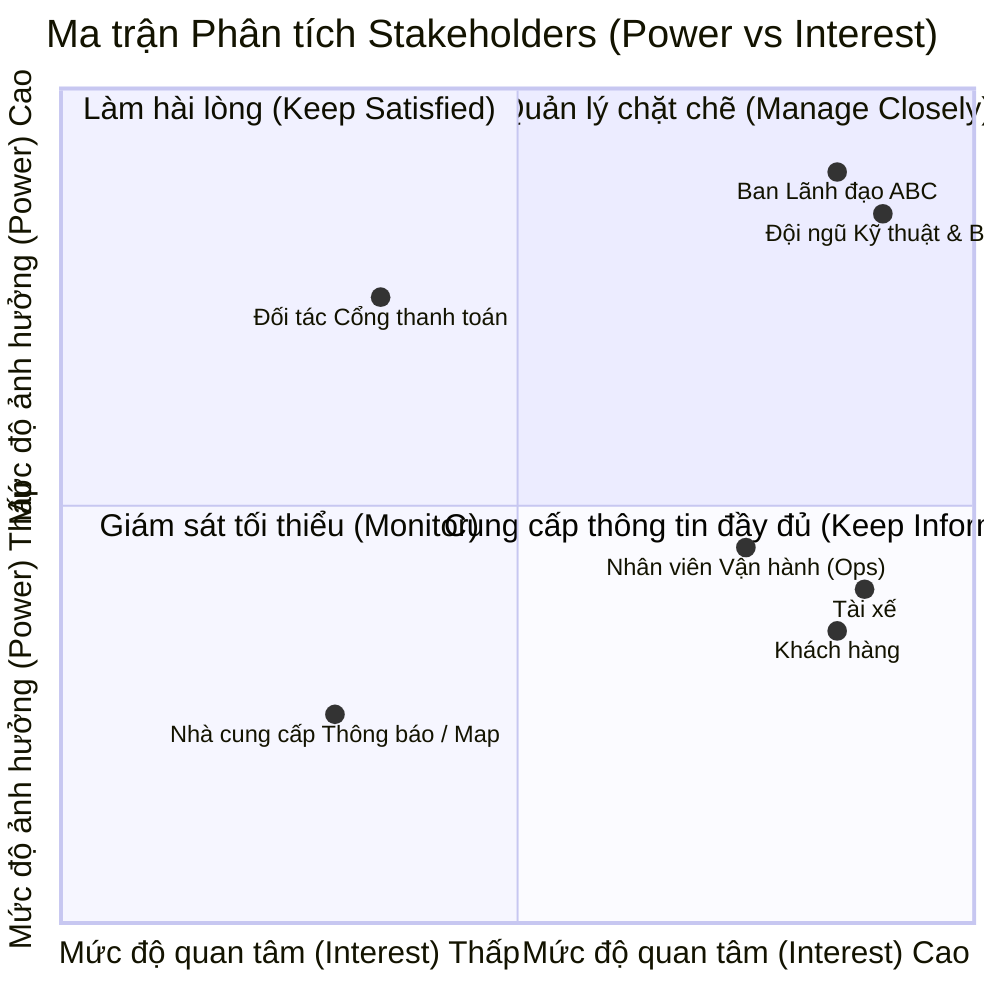
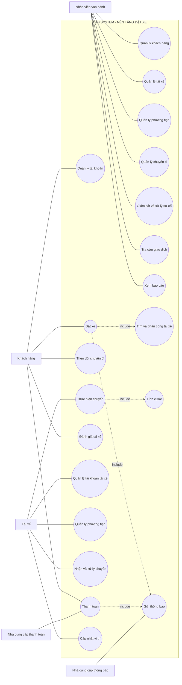

# 23637531_TranQuocThai_capsytem
# CAB System – Phân tích yêu cầu nghiệp vụ
---
## Tổng quan dự án

Công ty ABC là doanh nghiệp cung cấp dịch vụ đặt xe trực tuyến. Hiện tại khách hàng có thể liên hệ tổng đài hoặc sử dụng một ứng dụng đơn giản để yêu cầu xe.
Tuy nhiên, hệ thống hiện tại còn tồn tại nhiều hạn chế:
* Phân công tài xế chủ yếu được thực hiện thủ công.
* Khách hàng khó theo dõi trạng thái chuyến đi.
* Thông tin thanh toán chưa được quản lý tập trung.
* Bộ phận vận hành gặp khó khăn khi mở rộng hệ thống.
* Khả năng phát triển thêm tính năng trong tương lai còn hạn chế.
Do đó, Công ty ABC mong muốn xây dựng một nền tảng CAB mới có khả năng phục vụ số lượng lớn khách hàng và tài xế, đồng thời có kiến trúc đủ linh hoạt để phát triển lâu dài.
---
# BƯỚC 1 – TÌM HIỂU NGHIỆP VỤ
## 1.1. Vấn đề
Hệ thống hiện tại chưa đáp ứng tốt quá trình đặt và quản lý chuyến xe.
Các vấn đề chính:
1. Phân công tài xế còn thủ công.
2. Khách hàng khó theo dõi chuyến đi.
3. Thanh toán chưa được quản lý tập trung.
4. Nhân viên vận hành gặp khó khăn trong việc quản lý.
5. Khả năng mở rộng hệ thống còn hạn chế.
## 1.2. Mục tiêu
Xây dựng hệ thống CAB System nhằm:
* Tự động hóa quy trình đặt xe.
* Tìm kiếm và phân công tài xế phù hợp.
* Theo dõi trạng thái chuyến đi.
* Tính cước và hỗ trợ thanh toán.
* Gửi thông báo cho khách hàng và tài xế.
* Hỗ trợ nhân viên vận hành.
* Cung cấp báo cáo cho ban lãnh đạo.
* Đảm bảo bảo mật và khả năng mở rộng.
## 1.3. Người sử dụng hệ thống
Hệ thống có 3 nhóm người dùng chính:
| Người sử dụng      | Vai trò                      |
| ------------------ | ---------------------------- |
| Khách hàng         | Đặt xe và sử dụng dịch vụ    |
| Tài xế             | Nhận và thực hiện chuyến     |
| Nhân viên vận hành | Quản lý và giám sát hệ thống |
Ngoài ra còn có:
* **Ban lãnh đạo:** sử dụng dữ liệu và báo cáo để theo dõi hoạt động.
* **Nhà cung cấp thanh toán:** xử lý thanh toán điện tử.
* **Nhà cung cấp thông báo:** hỗ trợ gửi thông báo.
Tài liệu yêu cầu xác định rõ ba nhóm người dùng chính gồm khách hàng, tài xế và nhân viên vận hành.
---
# BƯỚC 2 – PHÂN TÍCH CÁC BÊN LIÊN QUAN
## 2.1. Stakeholders
| Stakeholders            | Vai trò                    | Tương tác với hệ thống                                    |
| ----------------------- | -------------------------- | --------------------------------------------------------- |
| Khách hàng              | Người sử dụng dịch vụ      | Đăng ký, đặt xe, theo dõi chuyến, thanh toán, đánh giá    |
| Tài xế                  | Người thực hiện chuyến     | Nhận/từ chối chuyến, cập nhật trạng thái, cập nhật vị trí |
| Nhân viên vận hành      | Quản lý hoạt động          | Quản lý khách hàng, tài xế, phương tiện và chuyến đi      |
| Ban lãnh đạo            | Quản lý doanh nghiệp       | Theo dõi báo cáo, doanh thu và hiệu quả hoạt động         |
| Nhà cung cấp thanh toán | Xử lý thanh toán           | Nhận yêu cầu và trả kết quả thanh toán                    |
| Nhà cung cấp thông báo  | Cung cấp dịch vụ thông báo | Gửi thông báo đến khách hàng và tài xế                    |

### 2.2. Ma trận Stakeholder (Mendelow Matrix)
* **Manage Closely (Quản lý chặt chẽ - Quyền lực cao, Quan tâm cao):** Ban Giám đốc ABC, Trưởng phòng Vận hành.
* **Keep Satisfied (Làm họ hài lòng - Quyền lực cao, Quan tâm thấp):** Cổng thanh toán đối tác, Cơ quan quản lý pháp lý vận tải.
* **Keep Informed (Cập nhật thường xuyên - Quyền lực thấp, Quan tâm cao):** Khách hàng, Đội ngũ Tài xế, Nhân viên CSKH.
* **Monitor (Giám sát tối thiểu - Quyền lực thấp, Quan tâm thấp):** Nhà cung cấp hạ tầng hosting/máy chủ.
> **Ma trận các bên liên quan (Stakeholder Power / Interest Matrix)


---
# BƯỚC 3 – MỤC ĐÍCH NGHIỆP VỤ
## 3.1. Mục đích tổng quát
Xây dựng một nền tảng CAB có khả năng quản lý toàn bộ quy trình:
```text
Đặt xe
   ↓
Tìm tài xế
   ↓
Phân công tài xế
   ↓
Thực hiện chuyến
   ↓
Tính cước
   ↓
Thanh toán
   ↓
Thông báo
   ↓
Đánh giá
```
## 3.2. Các mục đích chính
### 1. Tự động hóa đặt xe
Cho phép khách hàng tạo yêu cầu đặt xe trực tiếp trên hệ thống.
### 2. Tự động tìm tài xế
Hệ thống xác định tài xế phù hợp dựa trên vị trí, trạng thái sẵn sàng và các tiêu chí vận hành.
### 3. Theo dõi chuyến đi
Khách hàng có thể biết:
* Hệ thống đang tìm tài xế.
* Tài xế nào đã nhận chuyến.
* Thời gian dự kiến tài xế đến.
* Trạng thái hiện tại của chuyến.
### 4. Quản lý thanh toán
Hệ thống xác định số tiền cần thanh toán và hỗ trợ:
* Tiền mặt.
* Thanh toán điện tử.
### 5. Hỗ trợ vận hành
Nhân viên có thể quản lý:
* Khách hàng.
* Tài xế.
* Phương tiện.
* Chuyến đi.
* Giao dịch.
* Các trường hợp lỗi.
### 6. Hỗ trợ phát triển lâu dài
Hệ thống cần có khả năng bổ sung:
* Loại dịch vụ mới.
* Phương thức thanh toán mới.
* Nhà cung cấp thông báo mới.
* Thành phần kỹ thuật mới.
---
# BƯỚC 4 – XÁC ĐỊNH PHẠM VI DỰ ÁN
## 4.1. Thời gian
**Thời gian xây dựng và triển khai: 7 tuần.**
Vì thời gian giới hạn, dự án tập trung vào các chức năng nghiệp vụ cốt lõi.
## 4.2. Trong phạm vi
### Quản lý người dùng
* Đăng ký.
* Đăng nhập.
* Cập nhật thông tin.
* Quản lý tài khoản khách hàng.
* Quản lý tài khoản tài xế.
### Quản lý tài xế
* Quản lý hồ sơ.
* Quản lý phương tiện.
* Cập nhật trạng thái hoạt động.
* Cập nhật vị trí.
### Đặt xe
* Nhập điểm đón.
* Nhập điểm đến.
* Chọn loại xe.
* Gửi yêu cầu đặt xe.
### Phân công tài xế
* Tìm tài xế phù hợp.
* Ưu tiên tài xế gần khách hàng.
* Gửi yêu cầu cho tài xế.
* Xử lý tài xế từ chối/không phản hồi.
* Tiếp tục tìm tài xế khác.
### Quản lý chuyến
* Tài xế đến điểm đón.
* Đã đón khách.
* Đang di chuyển.
* Hoàn thành chuyến.
### Thanh toán
* Tính cước.
* Thanh toán tiền mặt.
* Thanh toán điện tử.
* Xử lý thanh toán thất bại.
### Thông báo
* Thông báo tiếp nhận yêu cầu.
* Thông báo tài xế nhận chuyến.
* Thông báo tài xế đến.
* Thông báo hoàn thành chuyến.
* Thông báo kết quả thanh toán.
### Quản trị
* Quản lý khách hàng.
* Quản lý tài xế.
* Quản lý phương tiện.
* Quản lý chuyến đi.
* Theo dõi chuyến đang diễn ra.
* Xử lý sự cố.
* Tra cứu giao dịch.
* Báo cáo.
## 4.3. Các vấn đề chưa chốt
Tài liệu xác định một số nội dung cần được Business Analyst làm rõ trước khi phát triển:
* Cách tính cước.
* Tiêu chí ưu tiên tài xế.
* Thời gian tài xế phải phản hồi.
* Chính sách hủy chuyến.
* Xử lý khi mất kết nối mạng.
* Thời gian lưu trữ dữ liệu.
---
# BƯỚC 5 – XÁC ĐỊNH YÊU CẦU NGHIỆP VỤ
| ID   | Business Requirement | Nội dung                                        |
| ---- | -------------------- | ----------------------------------------------- |
| BR01 | Quản lý khách hàng   | Quản lý tài khoản và thông tin khách hàng       |
| BR02 | Quản lý tài xế       | Quản lý tài khoản, hồ sơ và trạng thái          |
| BR03 | Quản lý phương tiện  | Quản lý thông tin phương tiện                   |
| BR04 | Đặt xe               | Cho phép khách hàng tạo yêu cầu đặt xe          |
| BR05 | Tìm tài xế           | Tìm tài xế phù hợp với chuyến                   |
| BR06 | Phân công tài xế     | Phân công tài xế cho yêu cầu                    |
| BR07 | Quản lý chuyến       | Theo dõi và cập nhật trạng thái chuyến          |
| BR08 | Quản lý vị trí       | Lưu vị trí tài xế                               |
| BR09 | Tính cước            | Xác định số tiền khách hàng phải trả            |
| BR10 | Thanh toán           | Hỗ trợ tiền mặt và điện tử                      |
| BR11 | Thông báo            | Gửi thông báo đến khách hàng và tài xế          |
| BR12 | Quản lý vận hành     | Theo dõi và xử lý hoạt động                     |
| BR13 | Báo cáo              | Báo cáo chuyến, doanh thu, tỷ lệ hoàn thành/hủy |
| BR14 | Đánh giá             | Khách hàng đánh giá tài xế                      |
| BR15 | Bảo mật              | Bảo vệ dữ liệu và kiểm soát quyền               |
---
# BƯỚC 6 – PHÂN RÃ YÊU CẦU CHỨC NĂNG
## 6.1. Khách hàng
```text
Khách hàng
├── Đăng ký
├── Đăng nhập
├── Cập nhật thông tin
├── Đặt xe
│   ├── Nhập điểm đón
│   ├── Nhập điểm đến
│   └── Chọn loại xe
├── Theo dõi chuyến
├── Xem lịch sử chuyến
├── Xem cước
├── Thanh toán
└── Đánh giá tài xế
```
## 6.2. Tài xế
```text
Tài xế
├── Quản lý hồ sơ
├── Quản lý phương tiện
├── Cập nhật trạng thái
├── Nhận thông báo chuyến
├── Chấp nhận chuyến
├── Từ chối chuyến
├── Cập nhật trạng thái chuyến
└── Cập nhật vị trí
```
## 6.3. Nhân viên vận hành
```text
Nhân viên vận hành
├── Quản lý khách hàng
├── Quản lý tài xế
├── Quản lý phương tiện
├── Quản lý chuyến đi
├── Theo dõi chuyến đang diễn ra
├── Kiểm tra trạng thái tài xế
├── Xử lý chuyến bị lỗi
├── Tra cứu giao dịch
└── Quản lý quyền truy cập
```
## 6.4. Hệ thống
```text
CAB System
├── Tìm tài xế
├── Phân công tài xế
├── Tính cước
├── Xử lý thanh toán
├── Gửi thông báo
├── Quản lý trạng thái chuyến
├── Lưu dữ liệu
└── Ghi log thao tác
```
---
# BƯỚC 7 – USE CASE DIAGRAM
## 7.1. Use case tổng quát

### Actor: Khách hàng
* Đăng ký / Đăng nhập
* Quản lý thông tin cá nhân
* Đặt xe
* Theo dõi chuyến
* Xem lịch sử
* Thanh toán
* Đánh giá tài xế
### Actor: Tài xế
* Quản lý hồ sơ
* Quản lý phương tiện
* Cập nhật trạng thái
* Nhận chuyến
* Chấp nhận/Từ chối chuyến
* Cập nhật trạng thái chuyến
* Cập nhật vị trí
### Actor: Nhân viên vận hành
* Quản lý khách hàng
* Quản lý tài xế
* Quản lý phương tiện
* Quản lý chuyến
* Giám sát chuyến
* Xử lý sự cố
* Tra cứu giao dịch
* Xem báo cáo
### External Actors
* Nhà cung cấp thanh toán.
* Nhà cung cấp thông báo.
## 7.2. Use Case trung tâm
```text
Khách hàng
    │
    ▼
Đặt xe
    │
    ▼
Tìm tài xế
    │
    ▼
Phân công tài xế
    │
    ▼
Thực hiện chuyến
    │
    ▼
Tính cước
    │
    ▼
Thanh toán
    │
    ▼
Đánh giá
```

---
# BƯỚC 8 – ĐẶC TẢ USE CASE
## UC01 – Đặt xe
| Thành phần         | Nội dung                        |
| ------------------ | ------------------------------- |
| **Use Case ID**    | UC01                            |
| **Tên**            | Đặt xe                          |
| **Actor**          | Khách hàng                      |
| **Mục tiêu**       | Tạo yêu cầu đặt xe              |
| **Tiền điều kiện** | Khách hàng đã đăng nhập         |
| **Đầu vào**        | Điểm đón, điểm đến, loại xe     |
| **Kết quả**        | Yêu cầu được hệ thống tiếp nhận |
### Luồng chính
```text
1. Khách hàng đăng nhập.
2. Nhập điểm đón.
3. Nhập điểm đến.
4. Chọn loại xe.
5. Gửi yêu cầu.
6. Hệ thống tiếp nhận yêu cầu.
7. Hệ thống bắt đầu tìm tài xế.
```
### Ngoại lệ
```text
Không tìm được tài xế
        ↓
Hệ thống thông báo cho khách hàng
```
---
## UC02 – Tìm và phân công tài xế
| Thành phần      | Nội dung                |
| --------------- | ----------------------- |
| **Use Case ID** | UC02                    |
| **Tên**         | Tìm và phân công tài xế |
| **Actor**       | Hệ thống                |
| **Mục tiêu**    | Tìm tài xế phù hợp      |
| **Điều kiện**   | Có yêu cầu đặt xe       |
### Luồng chính
```text
1. Nhận yêu cầu đặt xe.
2. Xác định tài xế phù hợp.
3. Ưu tiên tài xế gần khách hàng.
4. Gửi yêu cầu cho tài xế.
5. Nhận phản hồi.
6. Xác nhận tài xế.
7. Thông báo cho khách hàng.
```
### Ngoại lệ
```text
Tài xế từ chối / không phản hồi
            ↓
      Tìm tài xế khác
```
Nếu không tìm được tài xế, hệ thống phải thông báo rõ ràng cho khách hàng.
---
## UC03 – Thực hiện chuyến
| Thành phần      | Nội dung             |
| --------------- | -------------------- |
| **Use Case ID** | UC03                 |
| **Tên**         | Thực hiện chuyến     |
| **Actor**       | Tài xế               |
| **Mục tiêu**    | Hoàn thành chuyến đi |
### Trạng thái
```text
Tài xế đến điểm đón
        ↓
Đã đón khách
        ↓
Đang di chuyển
        ↓
Hoàn thành chuyến
```
---
## UC04 – Thanh toán
| Thành phần      | Nội dung                |
| --------------- | ----------------------- |
| **Use Case ID** | UC04                    |
| **Tên**         | Thanh toán              |
| **Actor chính** | Khách hàng              |
| **Actor phụ**   | Nhà cung cấp thanh toán |
| **Mục tiêu**    | Hoàn tất thanh toán     |
### Luồng chính
```text
Chuyến hoàn thành
       ↓
Tính cước
       ↓
Chọn phương thức thanh toán
       ↓
Xử lý thanh toán
       ↓
Nhận kết quả
       ↓
Thông báo khách hàng
```
### Ngoại lệ
Nếu thanh toán điện tử thất bại:
```text
Thanh toán thất bại
       ↓
Thông báo khách hàng
       ↓
Cho phép xử lý lại
```
---
## UC05 – Quản lý vận hành
| Thành phần      | Nội dung                    |
| --------------- | --------------------------- |
| **Use Case ID** | UC05                        |
| **Tên**         | Quản lý vận hành            |
| **Actor**       | Nhân viên vận hành          |
| **Mục tiêu**    | Giám sát và xử lý hoạt động |
### Chức năng chính
* Quản lý khách hàng.
* Quản lý tài xế.
* Quản lý phương tiện.
* Theo dõi chuyến.
* Kiểm tra trạng thái tài xế.
* Xử lý chuyến lỗi.
* Tra cứu giao dịch.
---
# BƯỚC 9 – PHÂN TÍCH QUY TRÌNH NGHIỆP VỤ
## 9.1. Quy trình đặt xe
```text
[START]
   ↓
Khách hàng đăng nhập
   ↓
Nhập điểm đón + điểm đến
   ↓
Chọn loại xe
   ↓
Gửi yêu cầu
   ↓
Hệ thống tiếp nhận
   ↓
Tìm tài xế phù hợp
   ↓
Có tài xế?
 ┌─┴──────────────┐
 │                │
Không            Có
 │                │
 ↓                ↓
Thông báo       Gửi yêu cầu
khách hàng      cho tài xế
 │                │
 ↓                ↓
[END]       Tài xế chấp nhận?
                 │
          ┌──────┴──────┐
          │             │
        Không           Có
          │             │
          ↓             ↓
    Tìm tài xế khác   Xác nhận
                        │
                        ↓
                 Thực hiện chuyến
                        │
                        ↓
                    Hoàn thành
                        │
                        ↓
                    Tính cước
                        │
                        ↓
                    Thanh toán
                        │
                        ↓
                     Đánh giá
                        │
                        ↓
                      [END]
```
## 9.2. Quy trình thực hiện chuyến
```text
Đã có tài xế
     ↓
Tài xế di chuyển đến điểm đón
     ↓
Đã đến điểm đón
     ↓
Đã đón khách
     ↓
Đang di chuyển
     ↓
Hoàn thành chuyến
```
Trong quá trình thực hiện, tài xế cập nhật trạng thái và hệ thống lưu thông tin vị trí để hỗ trợ việc tìm tài xế và dự kiến thời gian đến.
---
# BƯỚC 10 – PHÂN TÍCH QUY TẮC NGHIỆP VỤ
## 10.1. Quy tắc tài khoản
| ID   | Business Rule                                                               |
| ---- | --------------------------------------------------------------------------- |
| BR01 | Khách hàng phải đăng nhập trước khi sử dụng chức năng yêu cầu tài khoản     |
| BR02 | Tài xế phải được xác thực trước khi sử dụng các chức năng yêu cầu tài khoản |
| BR03 | Chức năng quản trị phải được kiểm soát quyền truy cập                       |
## 10.2. Quy tắc phân công tài xế
| ID   | Business Rule                                           |
| ---- | ------------------------------------------------------- |
| BR04 | Chỉ tài xế phù hợp và đang sẵn sàng mới được xem xét    |
| BR05 | Ưu tiên tài xế phù hợp và gần khách hàng                |
| BR06 | Nếu tài xế không phản hồi phải tiếp tục tìm tài xế khác |
| BR07 | Nếu tài xế từ chối phải tiếp tục tìm tài xế khác        |
| BR08 | Khách hàng không cần tạo lại yêu cầu                    |
| BR09 | Nếu không tìm được tài xế phải thông báo cho khách hàng |
Các quy tắc này xuất phát trực tiếp từ yêu cầu về cơ chế tìm và phân công tài xế trong tài liệu.
## 10.3. Quy tắc chuyến đi
| ID   | Business Rule                                       |
| ---- | --------------------------------------------------- |
| BR10 | Tài xế phải cập nhật trạng thái chuyến              |
| BR11 | Hệ thống phải lưu thông tin vị trí tài xế           |
| BR12 | Chuyến phải được cập nhật đến trạng thái hoàn thành |
## 10.4. Quy tắc thanh toán
| ID   | Business Rule                                                       |
| ---- | ------------------------------------------------------------------- |
| BR13 | Hệ thống tính số tiền khách hàng phải trả sau khi chuyến hoàn thành |
| BR14 | Hỗ trợ thanh toán tiền mặt                                          |
| BR15 | Hỗ trợ thanh toán điện tử                                           |
| BR16 | Không lưu trực tiếp thông tin nhạy cảm của thẻ/tài khoản thanh toán |
| BR17 | Thanh toán thất bại phải thông báo cho khách hàng                   |
| BR18 | Cho phép xử lý lại thanh toán theo chính sách doanh nghiệp          |
Tài liệu yêu cầu hệ thống tích hợp với nhà cung cấp thanh toán bên ngoài và không lưu trực tiếp thông tin nhạy cảm của thẻ hoặc tài khoản thanh toán.
## 10.5. Quy tắc thông báo
| ID   | Business Rule                                              |
| ---- | ---------------------------------------------------------- |
| BR19 | Thông báo khi yêu cầu đặt xe được tiếp nhận                |
| BR20 | Thông báo khi tài xế nhận chuyến                           |
| BR21 | Thông báo khi tài xế đến điểm đón                          |
| BR22 | Thông báo khi chuyến hoàn thành                            |
| BR23 | Thông báo kết quả thanh toán                               |
| BR24 | Tài xế nhận thông báo về chuyến mới và thay đổi của chuyến |
## 10.6. Quy tắc bảo mật
| ID   | Business Rule                             |
| ---- | ----------------------------------------- |
| BR25 | Thông tin cá nhân phải được bảo vệ        |
| BR26 | Thông tin phương tiện phải được bảo vệ    |
| BR27 | Dữ liệu vị trí phải được bảo vệ           |
| BR28 | Dữ liệu giao dịch phải được bảo vệ        |
| BR29 | Các thao tác quan trọng phải được lưu vết |
| BR30 | Chức năng quản trị phải được phân quyền   |
Các yêu cầu về xác thực, phân quyền, bảo vệ dữ liệu và lưu vết thao tác được nêu trong tài liệu yêu cầu của dự án.
---
